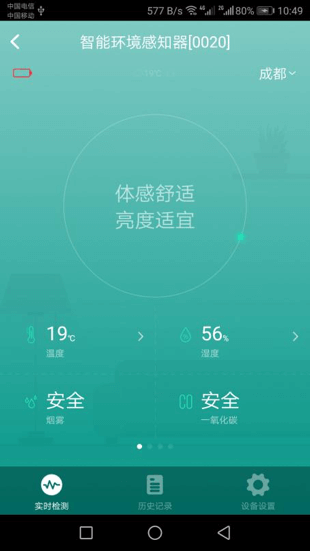
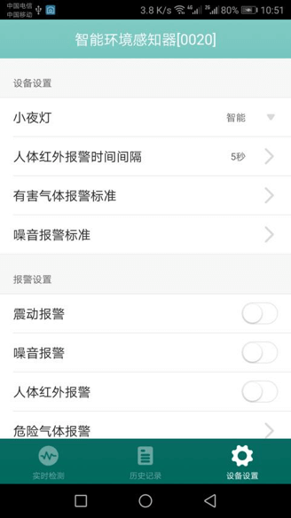

# 智能环境感知器

&emsp;&emsp;在设备列表或标签界面点击智能环境感知器进入控制界面，将看到实时捡测、历史记录、设备设置界面。

1. 实时检测：该设备可以实时检测温度、湿度、烟雾、一氧化碳、亮度、噪音、甲醛、甲烷、水浸、二氧化碳、TVOC、震动、人、PM2.5数据，并显示在控制界面，左右滑动界面即可查看；可以显示电池电量，可以设置当前位置，显示当前城市的天气情况。

	
	
2. 历史记录：显示该设备所有检测情况，点击历史记录界面全部按钮即可根据所选项过滤历史记录。

	
	
3. 设备设置

	

	1.	小夜灯：可以设置指示灯的显示状态。
	2.	人体红外报警时间间隔：设置红外报警的时间间隔在5秒到15分之间。
	3.	有害气体报警标准：设置甲醛、二氧化碳、TVOC、PM2.5的报警标准。
	4.	噪音报警标准：设置噪音报警标准。
	5.	震动报警：设置震动报警的开关状态。
	6.	噪音报警：设置噪音报警的开关状态。
	7.	人体红外报警：设置红外报警的开关状态。
	8.	危险气体报警：设置甲烷、烟雾、一氧化碳报警的开关状态。
	9.	有害气体报警：设置甲醛、二氧化碳、TVOC、PM2.5报警的开关状态。
	10.	帮助：可以在这里查看该设备相关的常见问题以及解决办法。
	11. 设备信息：可以查看该设备的序列号、版本号等信息。