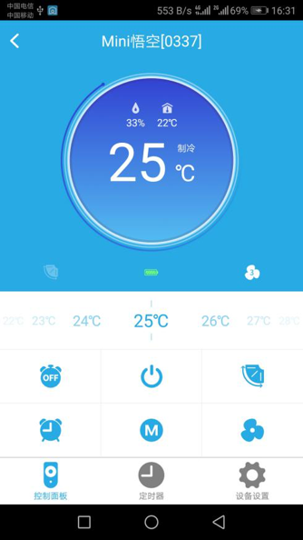
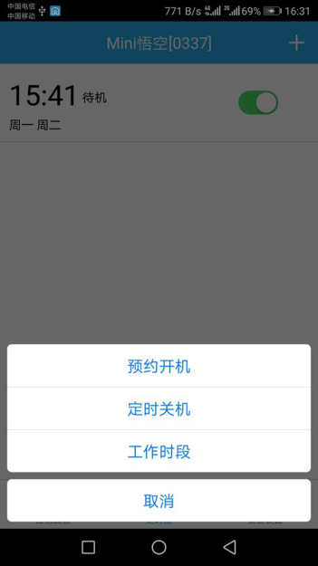
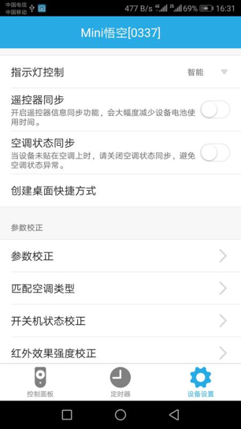

# Mini悟空

&emsp;&emsp;在设备列表或标签界面点击Mini悟空进入控制界面。 将看到控制面板、定时器、设备设置界面。

1. 控制面板：可以查看空调的运行状态，包括开关、室温、湿度、模式、设定温度、风速、电量；可以设置空调的开关、设定温度、模式、风速、定时等等。

	
	
2. 定时器：可以设置预约开机、定时关机、工作时段三种类型的定时器。

	
	
3. 设备设置：

	
	
	1. 指示灯控制：可以设置指示灯的显示状态。
	2. 遥控器同步：该设备和空调遥控器状态是否同步开关。
	3. 空调状态同步：该设备和空调状态是否同步开关。
	4. 创建桌面快捷方式：会在手机桌面生成一个设备的快捷入口。
	5.	参数校正：可以校正温度。
	6.	匹配空调类型：学习空调遥控器的红外编码。
	7.	开关机状态校正：校正空调开关机状态。
	8.	红外效果强度校正：校正红外轻度。
	9.	帮助：可以在这里查看该设备相关的常见问题以及解决办法。
	10. 设备信息：可以查看该设备的序列号、版本号、红外ID等信息。
