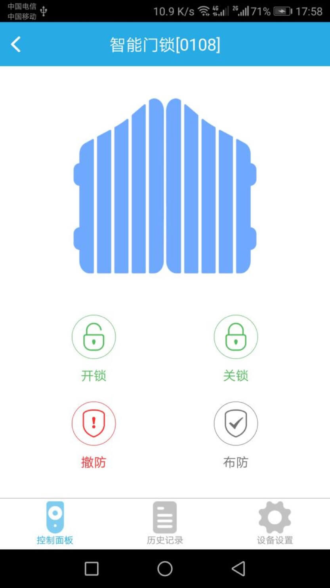
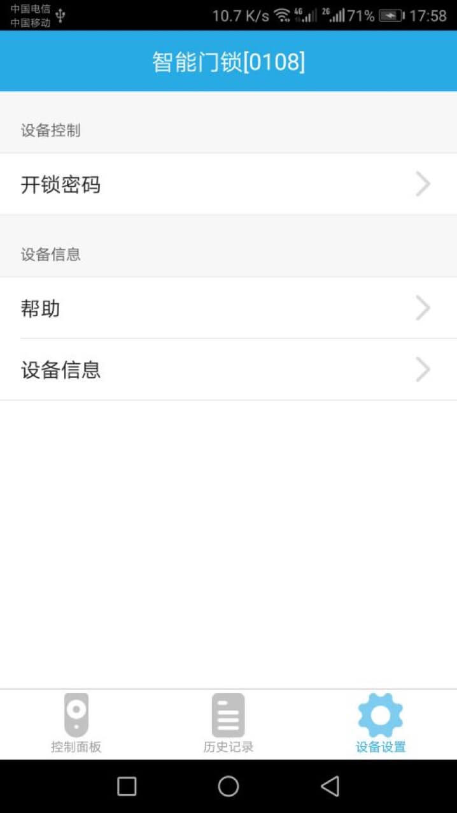

# 智能门锁

&emsp;&emsp;在设备列表或标签界面点击智能门锁进入控制界面，将看到控制面板、历史记录、设备设置界面。

1. 控制面板：显示智能门锁的开关状态、布防撤防状态；可以设置开锁、关锁、布防、撤防。

	

2. 历史记录：显示该设备所有操作及报警记录。
3. 设备设置：

	

	1. 开锁密码：设置智能门锁的开锁密码。
	2. 帮助：查看该设备相关的常见问题及解决办法。
	3. 设备信息：查看该设备的详细等信息。

