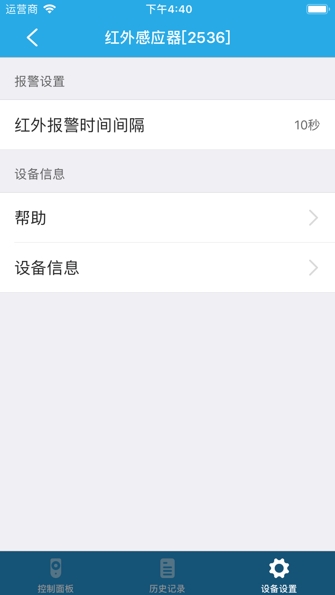

# 人体感应器

&emsp;&emsp;在设备列表或标签页面点击人体感应器进入控制页面。您将看到控制面板、历史记录和设备设置界面。

1. 控制面板：您可以控制设备的布防和撤防。

	
	
2. 历史记录：您可以查看设备的历史记录。

	
	
3. 设备设置：

	
	
	1. 红外报警时间间隔：您可以设置红外报警时间间隔。
	2. 帮助：查看该设备的常见问题及解决办法。
	3. 设备信息：查看该设备的详细信息。
	