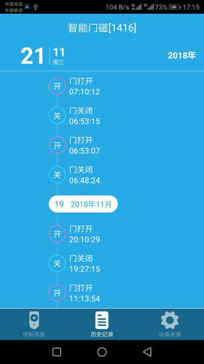

# 智能门磁

&emsp;&emsp;在设备列表或标签界面点击智能门磁进入控制界面。 将看到控制面板、历史记录、设备设置界面。

1. 控制面板：可以查看智能门磁的运行状态，包括开关、布防撤防状态；可以查看历史记录；可以设置智能门磁的布防撤防状态。

	
	
2.	历史记录：记录智能门磁的开关及报警等操作。

	
	
3.	设备设置：

	
	
	1. 报警声音：可以设置该设备报警的铃声及音量。
	2.  帮助 ：可以在这里查看该设备相关的常见问题以及解决办法。
	3. 设备信息：可以查看该设备的序列号、版本号信息

