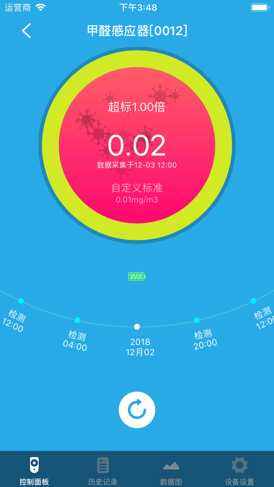

# 甲醛感应器

&emsp;&emsp;在设备列表或标签页面点击甲醛感应器进入控制页面。您可能会看到控制面板、历史记录、数据图和设备设置界面。

1. 控制面板：您将看到当前设备的状态，最近一次数据采集时间，当前设置的报警标准。您还可以即时刷新数据采集时间。

	
	
	
2. 历史记录：您将看到设备的历史记录。

	
	
3. 数据图（部分设备支持）：您可以看到近期的甲醛含量数据图。

	
	
4. 设备设置：

	
	
	1. 设置：您可以设置甲醛含量的标准值以及报警时间间隔。

		
		
	2. 帮助：您将看到该设备的常见问题及解决办法。
	3. 设备信息：您将看到该设备的详细信息。