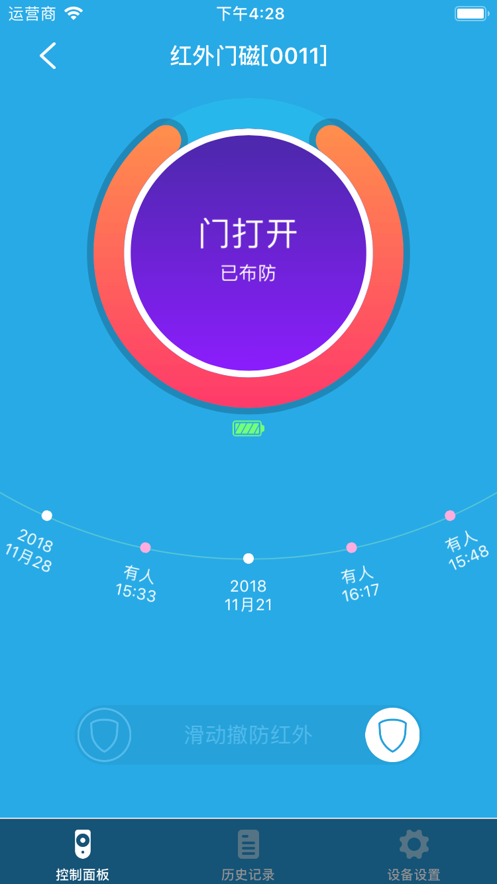
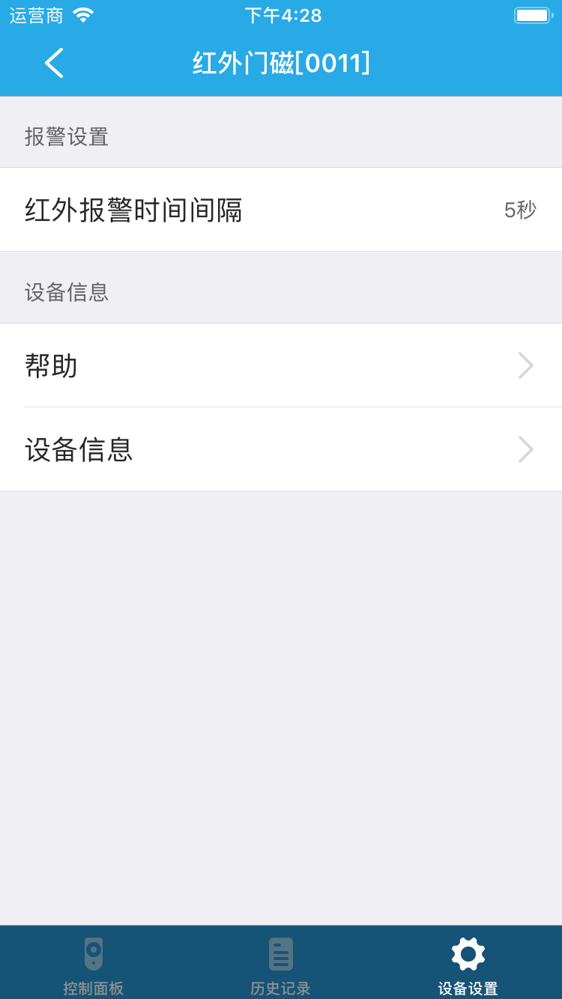

# 红外门磁

&emsp;&emsp;在设备列表或标签页面点击红外门磁进入控制界面。您将看到控制面板、历史记录、设备设置界面。

1. 控制面板:您可以看到当前设备的状态，门打开或关闭，布防或撤防，同时，可以控制布防或撤防。

	
	
2. 历史记录：您可以看到设备状态变化。
3. 设备设置：

	
	
	1. 红外报警时间间隔：您可以设置红外报警时间间隔。
	2. 帮助：您可以在这里查看该设备相关的常见问题以及解决办法。
	3. 设备信息：您可以查看该设备的详细信息。