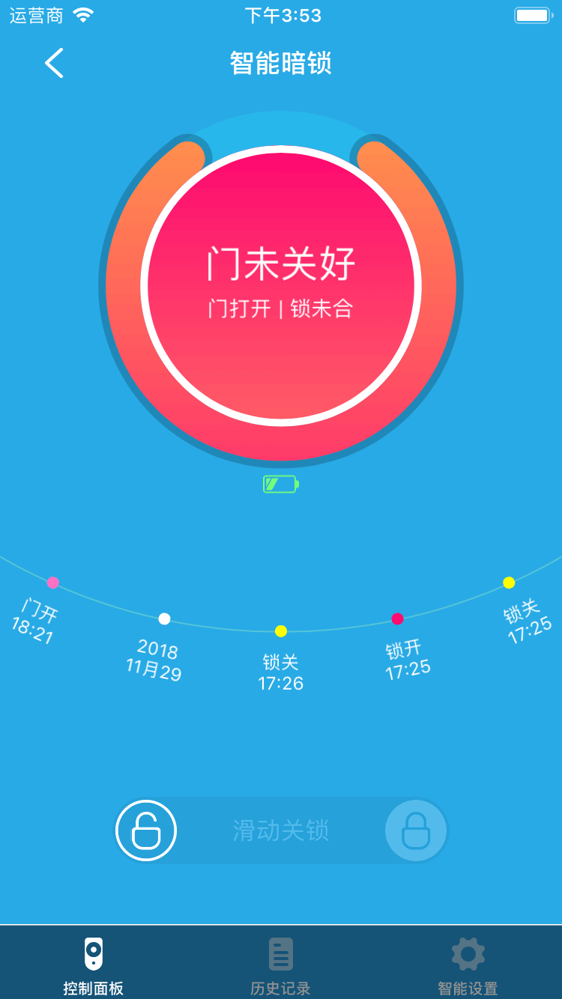
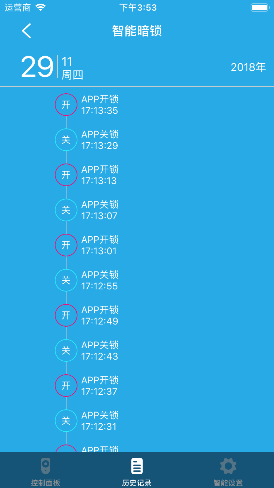
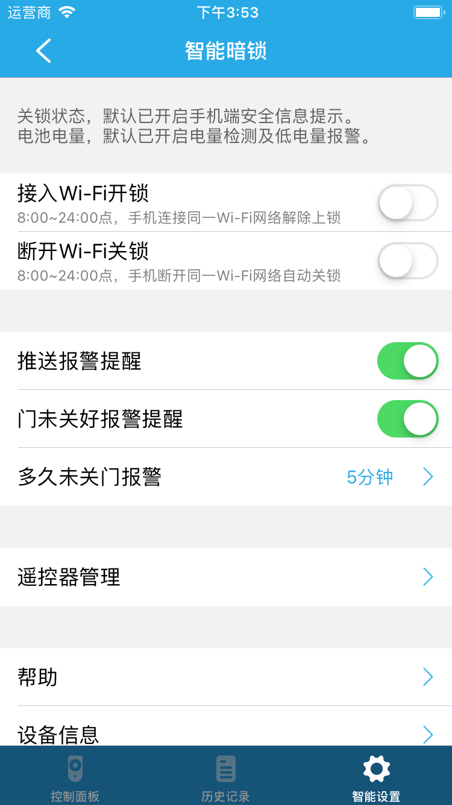

# 智能暗锁

点击设备列表或标签页面的智能暗锁进入设备控制界面，您将看到控制面板、历史记录、智能设置界面。

1. 控制面板：您可以查看当前设备状态以及实现滑动开锁、关锁。

	
	
2. 历史记录：您可以看到设备变化状态记录。

	
	
3. 智能设置:

	

	1. 接入Wi-Fi开锁：启用改功能后，在08:00~24:00手机连接同一Wi-Fi自动开锁。
	2. 断开Wi-Fi关锁：启用改功能后，在08:00~24:00手机连接同一Wi-Fi自动关锁。
	3. 推送报警提醒：启用该功能后，设备报警时您将收到推送信息。
	4. 门未关好报警提醒：启用该功能后，在门未关的情况下你会收到推送信息，同时您可以设置间隔时间。
	5. 遥控器管理：可以进行遥控器的挂失、解除挂失、删除。
	6. 帮助：查看该设备的常见问题及解决方法。
	7. 设备信息：查看该设备的详细信息。