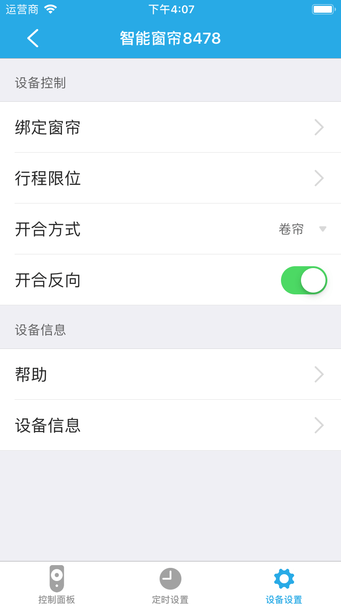
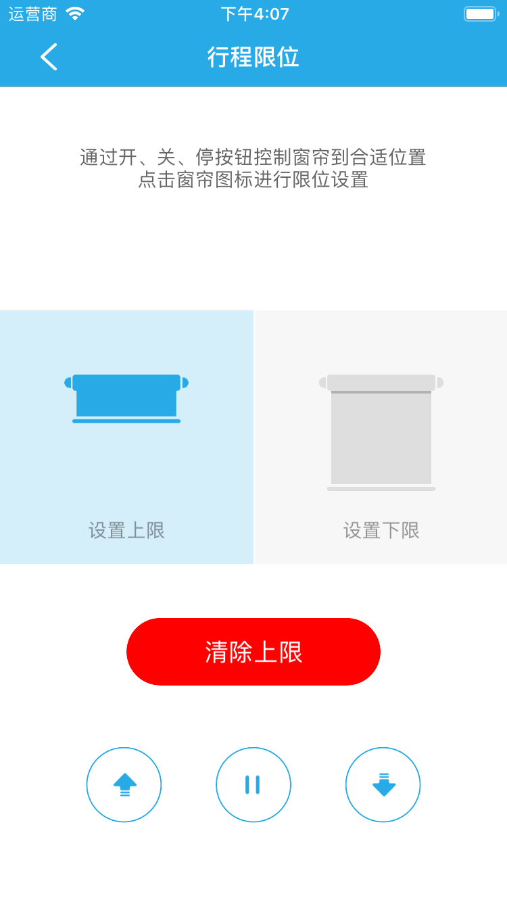

# RF窗帘

&emsp;&emsp;在设备列表或者标签界面点击进入控制界面。您将看到控制面板、定时设置、设备设置3个界面。

1. 控制面板：控制窗帘的开启状态，全开、全关、开窗百分比。

	
	
2. 定时设置：添加定时器控制窗帘。
3. 设备设置：

	
	
	1. 绑定窗帘：如果您的窗帘是两层的，您可以绑定另外一个窗帘电机，对窗帘进行同步控制。
	2. 行程限位：您可以设置行程上限和行程下限。
	
		
		
	3. 开合方式：根据的您的窗帘类型设置是卷帘或开合帘。
	4. 开合反向：如果窗帘当前状态是开窗30%，启动该功能后，窗帘状态是变成开窗70%。
	5. 帮助：查看该设备的常见问题及解决方法。
	6. 设备信息：查看设备的详细信息。
