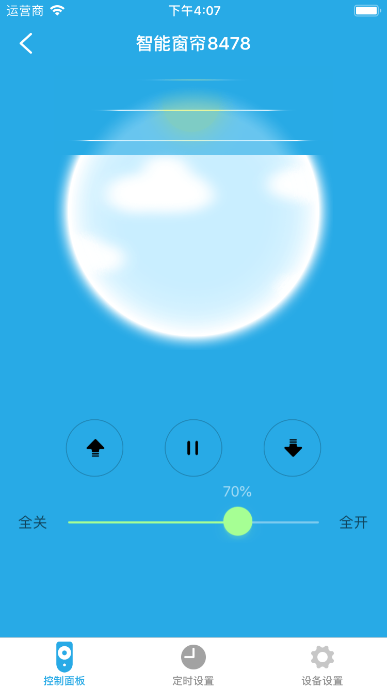
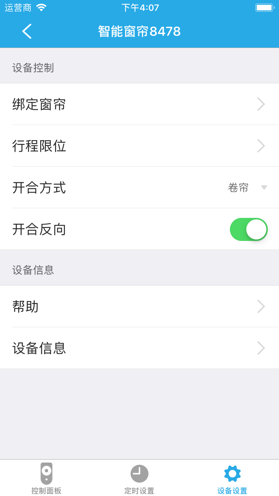

# RF窗帘

&emsp;&emsp;在设备列表或者标签界面点击进入控制界面。您将看到控制面板、定时设置、设备设置3个界面。

1. 控制界面：您可以控制窗帘的开启状态，全开、全关、开窗百分比。

	
	
2. 定时设置：您可以最多设置5个定时器。
3. 设备设置：进入设备设置页面您将看到这些设置：绑定窗帘、行程限位、开合方式、开合反向等。

	
	
	1. 绑定窗帘：如果您的窗帘是两层的，您可以绑定另外一个窗帘电机，对窗帘进行同步控制。
	2. 行程限位：您可以设置行程上限和行程下限。
	
		
		
	3. 开合方式：您的窗帘是卷帘还是开合帘，根据实际情况进行设置。
	4. 开合反向：如果您之前是开窗30%，启动该功能后，窗帘状态是变成开窗70%。
