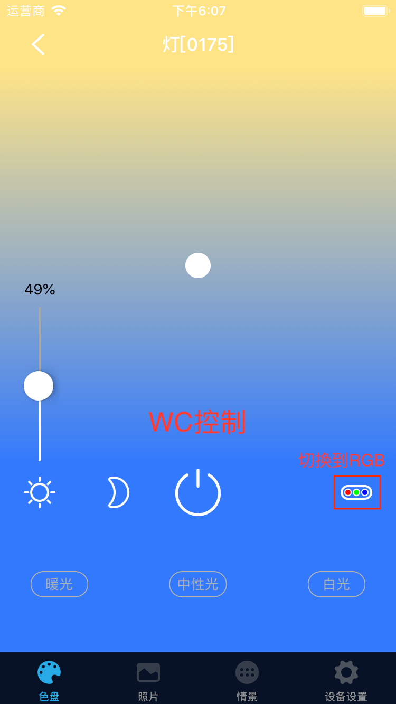

# 灯

&emsp;&emsp;在设备列表或标签页面点击进入灯的控制界面。您将看到色盘、照片、情景和设备设置界面。

1. 色盘：您可以通过RGB值或WC值(部分设备只支持一种)来控制灯的颜色。选择一种方式后点击色盘任意位置即可控制灯的颜色。同时，也可以滑动亮度条来控制亮度。

    
    
    

2. 照片：您可以点击照片任意位置控制灯的颜色。或者点击右上角的+从相册选择照片，从选择的照片来控制灯的颜色。

	
	
3. 情景：设置灯的情景控制灯的不同效果。

	
	
4. 设备设置：

	
	
	1. 帮助：查看该设备相关的常见问题以及解决办法。
	2. 设备信息：查看该设备的详细信息。
	3. 渐亮渐灭：设置灯的渐亮渐灭效果（快速、中速、慢速）。
