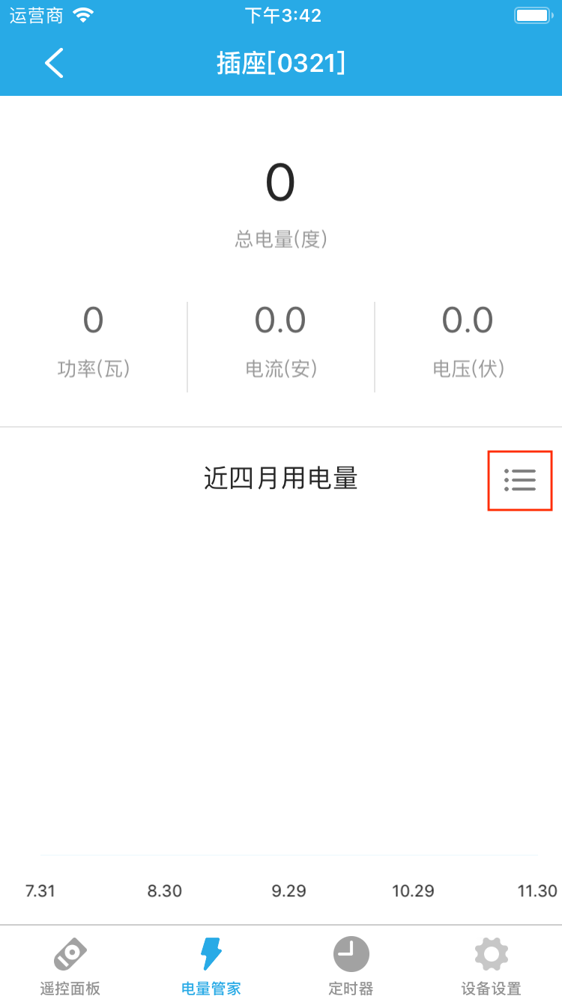
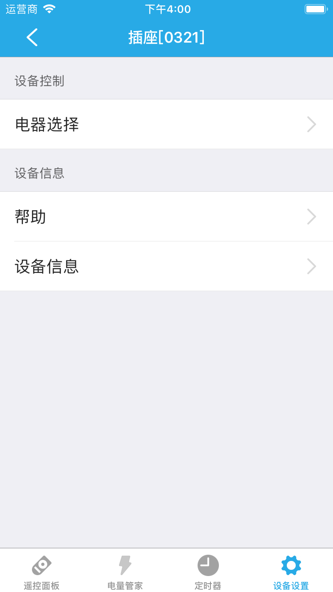

# 插座

&emsp;&emsp;在设备列表或标签页面点击智能插座进入控制界面。您将看到控制面板、电量管家、定时器、设备设置界面。

1. 控制面板:可以控制插座的通电或断电。
2. 电量管家:查看近4个月的用电量。点击右侧的⋮☰按钮，可以查看近1年的用电量以及详细信息。

	
	
3. 定时器:添加定时器来实现通电断电。
4. 设备设置：

	
	
	1. 电器选择：提供了8种类型供您选择，分别是：饮水机、台灯、风扇、热水器、路由器、冰箱、音响、其它。设置后将显示对应的图标和名称(如果您没有修改名称)，方便查看。
	2. 设备信息：查看该设备的详细信息。
	3. 帮助：查看该设备相关的常见问题以及解决办法。
