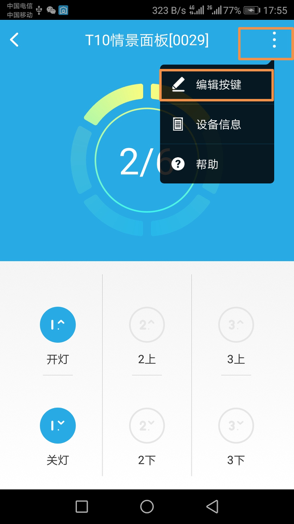

# 情景面板

&emsp;&emsp;在设备列表或标签界面点击情景面板进入控制界面，该设备的按键可以绑定情景模式或联动，点击界面按钮或设备按键即可一键执行情景模式或联动。

## 编辑按键 ##

1. 在控制界面点击右上方更多按钮，即可看到编辑按键选项。

	
	
2. 点击编辑按键选项进入编辑按键界面，点击其中任意按键，即可看到选择联动和快捷情景选项，按步骤选择联动或情景模式即可完成。

	
	

	