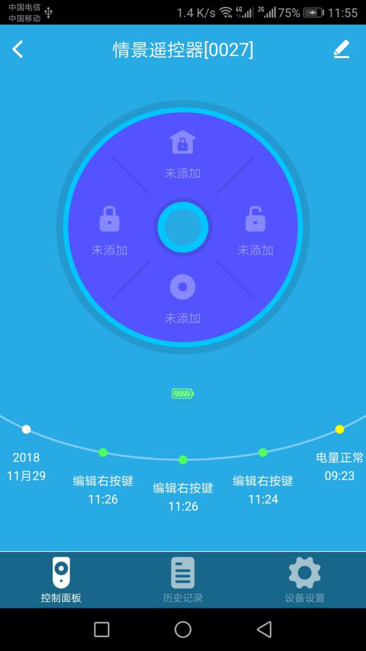
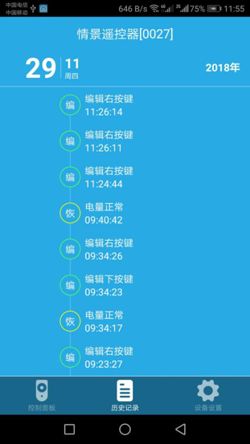
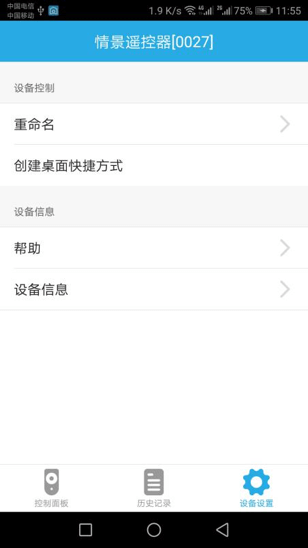

# 情景遥控器

&emsp;&emsp;在设备列表或标签界面点击情景遥控器进入控制界面，将看到控制面板、历史记录、设备设置界面。该设备的按键可以添加联动，点击界面按钮或设备按键即可一键执行联动。

1. 控制面板：显示按键、历史记录、电池电量，未添加联动的按键可以点击按钮按照步骤添加联动，已添加联动的按键可以点击按钮执行联动。

	
	
2. 历史记录：显示该设备操作的记录。

	
	
3. 设备设置：

	
	
	1.	重命名：对按键重新命名。
	2.	创建桌面快捷方式(安卓版本支持)：会在手机桌面生成一个设备的快捷入口。
	3.	帮助：查看该设备相关的常见问题以及解决办法。
	4.	设备信息：查看该设备的详细等信息。
