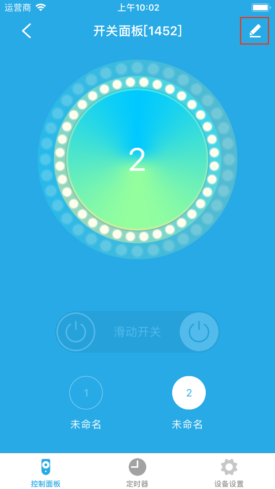
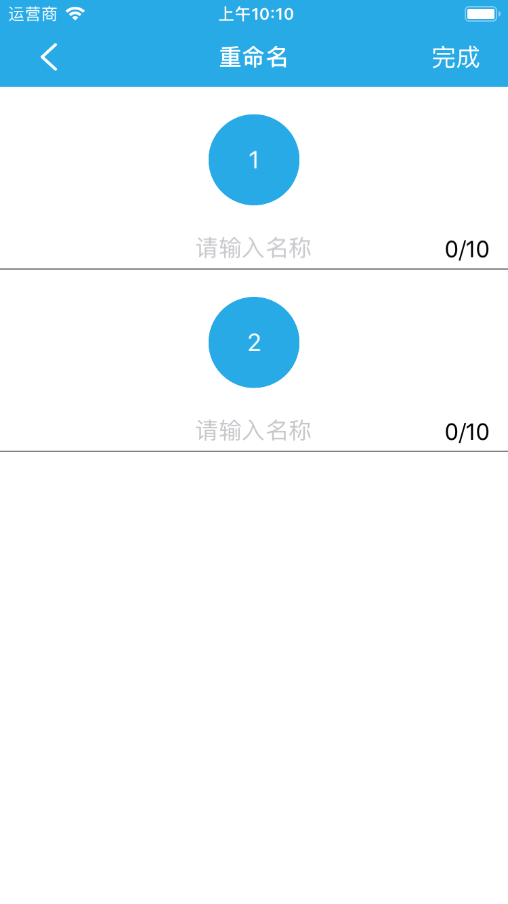
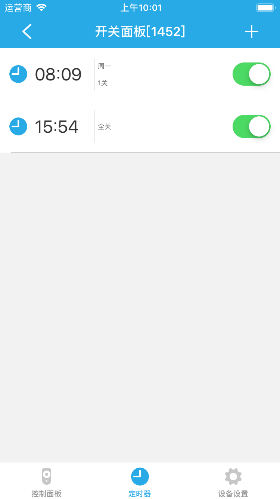
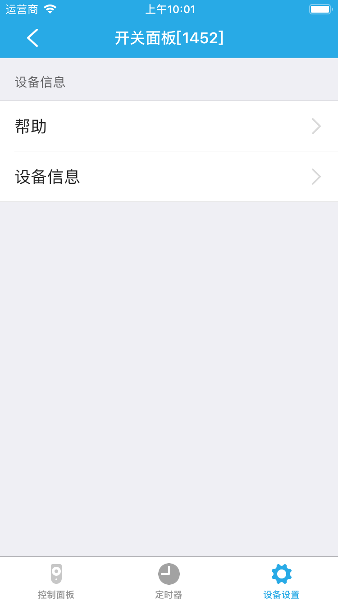

# 开关面板

&emsp;&emsp;点击设备列表或标签页面的开关面板进入设备控制界面。您将看到控制面板、定时器、设备设置界面。

1. 控制面板：开关面板支持多路开关，您可以看到每一路的状态。

	
	
	您可以点击右上角的编辑按钮，给每一路命名。
	
	
	
	
	
2. 定时器：您可以点击右上角的+添加定时器来控制设备。

	
	
3. 设备设置：

	
	
	1. 帮助：查看该设备相关的常见问题以及解决办法。
	2. 设备信息：查看该设备的详细信息。