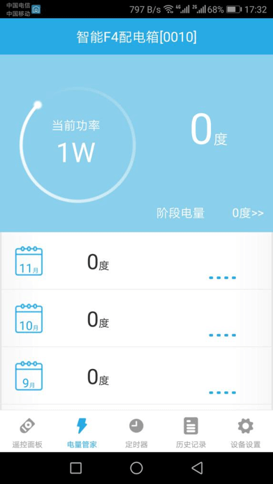

# 智能配电箱

&emsp;&emsp;在设备列表或标签界面点击智能配电箱进入控制界面，将看到遥控面板、电量管家、定时器、历史记录、设备设置界面。

1. 遥控面板：显示功率、电压、电流、开关状态；点击开关可以设置该设备的开关。

	
	
2. 电量管家：可以查看近一年的电量以及电量详细信息，还可以查看阶段电量并且可以清零。

	
	
3. 定时器：可以设置预约开关定时、工作时段两种类型的定时器。
4. 历史记录：显示该设备的所有操作及报警记录。
5. 设备设置：

	

	1.	创建桌面快捷方式(安卓版本支持)：会在手机桌面生成一个设备的快捷入口。
	2.	推送通知：可以设置是否报警。
	3.	过载功率保护：可以设置是否开启过载保护。
	4.	恶性负载检测：可以设置是否检测是否有大功率用电电器。
	5.	帮助：查看该设备相关的常见问题以及解决办法。
	6.	设备信息：查看该设备的详细信息。
	7.	远程重启(部分设备支持)：远程重启该设备。
	8.	检查更新：显示该设备当前版本号并检测是否需要升级。
