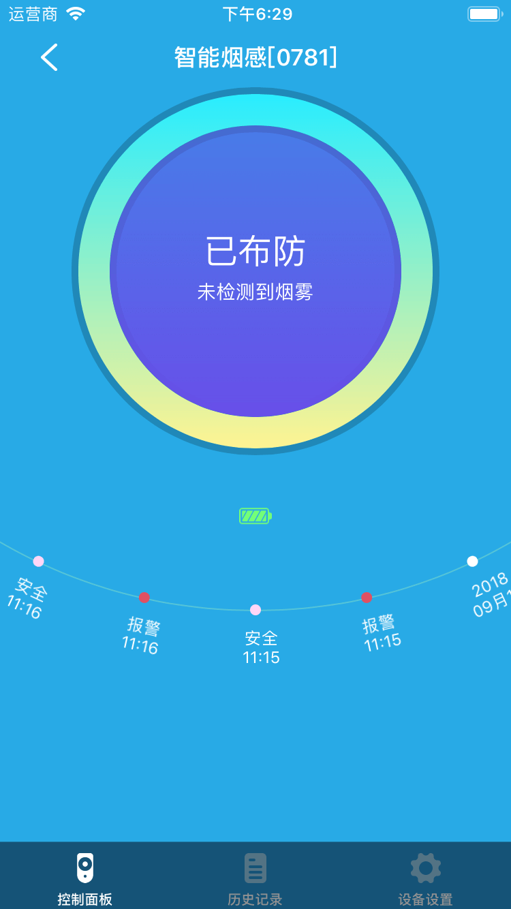
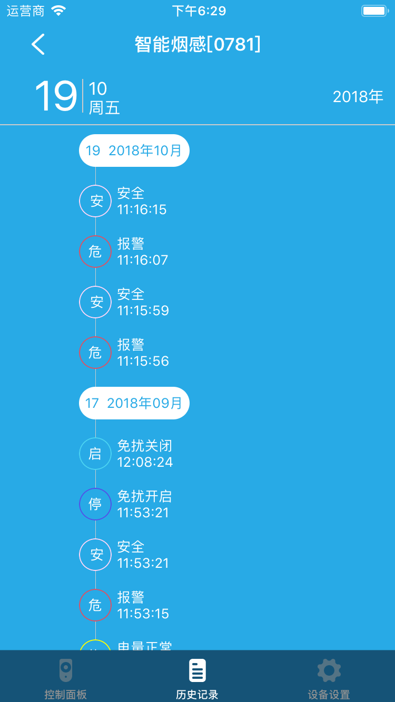

# 智能烟感

在设备列表或标签页面点击智能烟感设备进入控制页面。您将看到控制面板、历史记录、设备设置界面。

1. 控制界面：您将看到当前设备是否处于布防状态。只有在布防状态才能检测烟雾。同时能看到设备的电量状态，历史记录。

	
	
2. 历史记录：您将看到设备的历史记录。

	
3. 设备设置：您将看到：帮助和设备信息选项。
	1. 帮助：您将看到该设备的常见问题及解决办法。
	2. 设备信息：您将看到设备的详细信息。