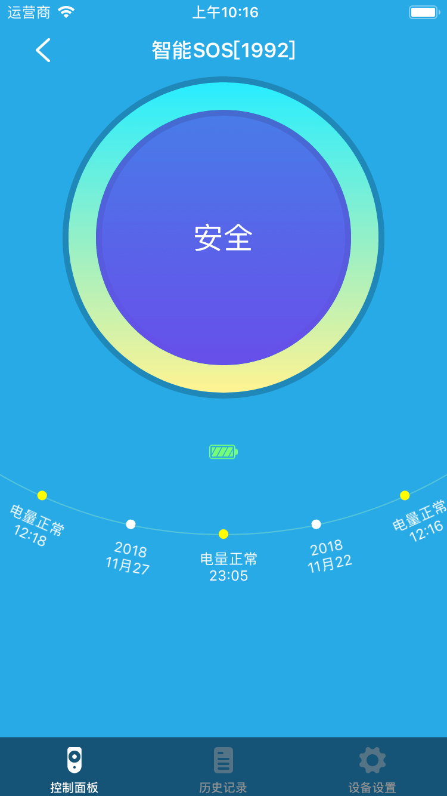
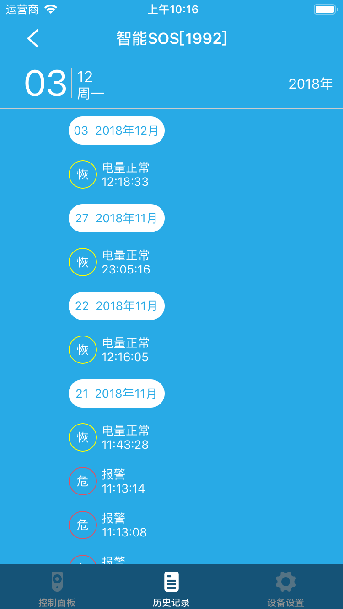
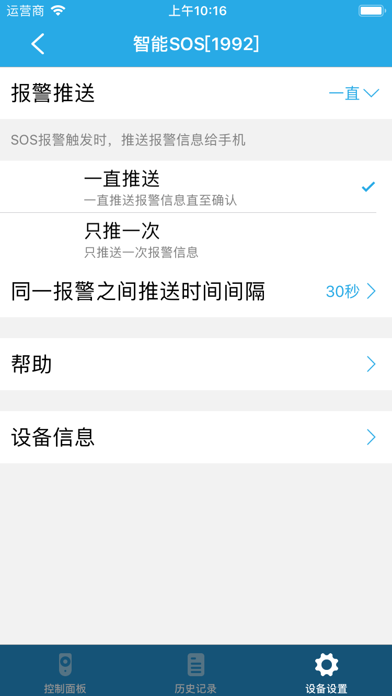
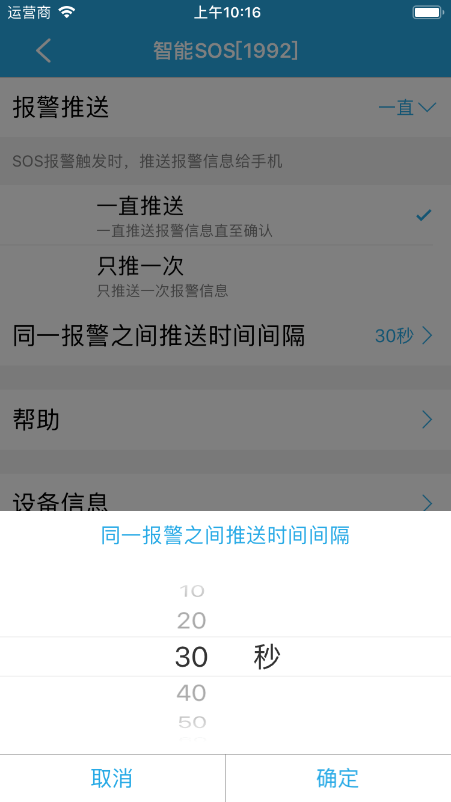

# 智能SOS

&emsp;&emsp;在设备列表或标签页面点击智能SOS设备进入控制页面。您将看到控制面板、历史记录、设备设置界面。

1. 控制面板：查看当前设备的状态。

	
	
2. 历史记录：查看设备的历史记录。

	
	
3. 设备设置：您可以看到报警推送、同一报警之间推送时间间隔、帮助、设备信息。

	1. 报警推送：您可以设置成“一直推送”或者“只推送一次”。
		
		
		
	2. 同一报警之间推送时间间隔：只有将报警推送设置成“一直推送”才能设置报警时间间隔，可以设置为10~60秒。
		
		
		
	3. 帮助：查看设备的常见问题及解决办法。
	4. 设备信息：查看设备的详细信息。