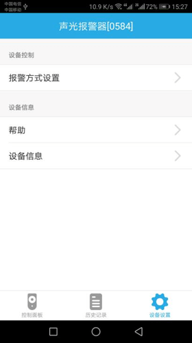

# 声光报警器

&emsp;&emsp;在设备列表或标签界面点击声光报警器进入控制界面，将看到控制面板、历史记录、设备设置界面。

1. 控制面板：声光报警器有照明模式和警笛模式两种，警笛模式可以触发警笛报警，照明模式可以设置灯的状态。

    
    
	
	
2. 历史记录：记录声光报警器灯的开关及报警等操作。
3. 设备设置:

	
	
	1. 报警方式设置：可以设置报警时间间隔。
	2. 帮助：查看该设备相关的常见问题以及解决办法。
	3. 设备信息：查看该设备的详细信息。