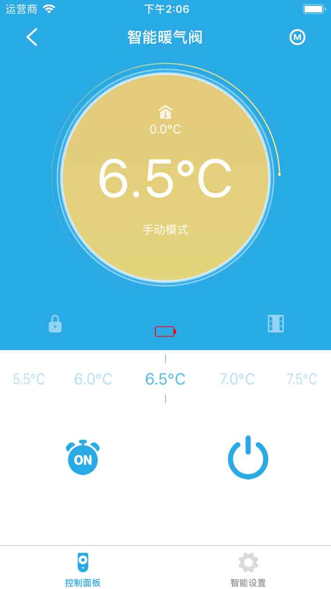
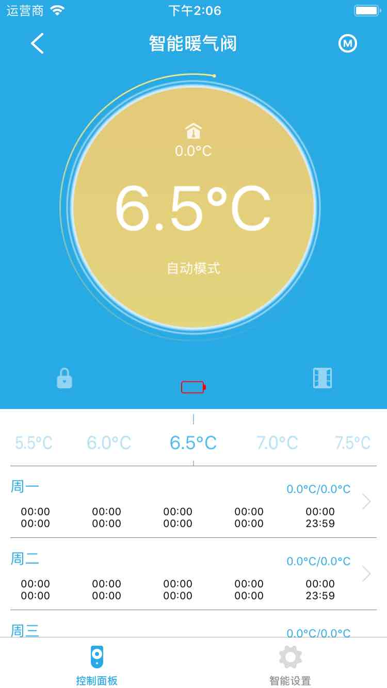
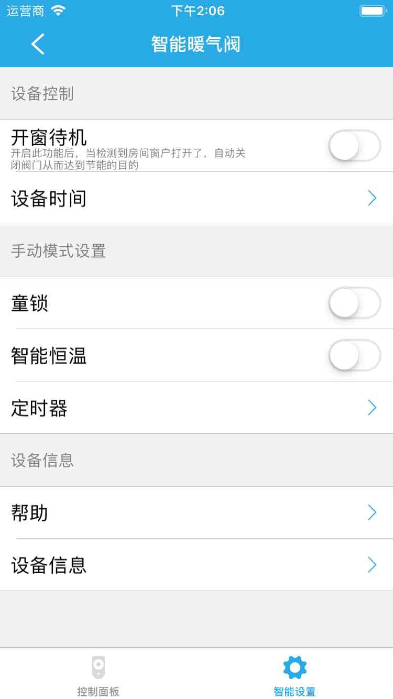

# 暖气阀

&emsp;&emsp;在设备列表或者标签界面点击暖气阀进入控制界面。您将看到控制面板、智能设置界面。

1. 控制面板：可以设置暖气阀的温度，定时等等。

	
	
	您可以点击右上角的Ⓜ按钮，切换模式。
	
	
	
2. 智能设置：

	
	
	1. 开窗待机：开启此功能后，当检测到房间窗户打开了，自动关闭阀门从而达到节能的目的。
	2. 设备时间：可以设置设备的时间。		
	3. 童锁：该功能启用时，部分按钮会暂时失去控制功能，避免了儿童因好奇误操作而导致的危险。
	4. 智能恒温：可以设置暖气阀在某一时间段保持在某一个温度范围。
	5. 定时器：可以添加定时器来控制暖气阀。
	6. 帮助：查看该设备的常见问题及解决方法。
	7. 设备信息：查看设备的详细信息。
