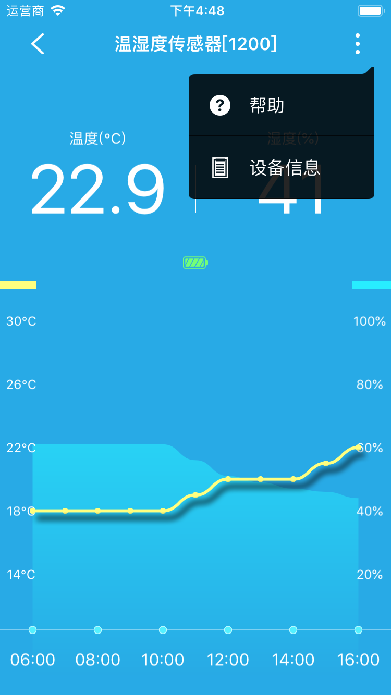
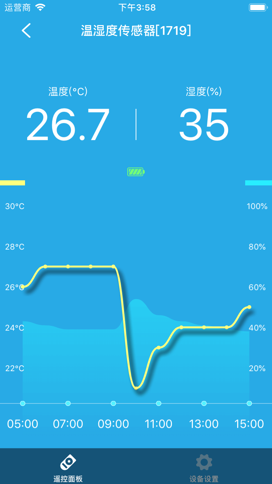
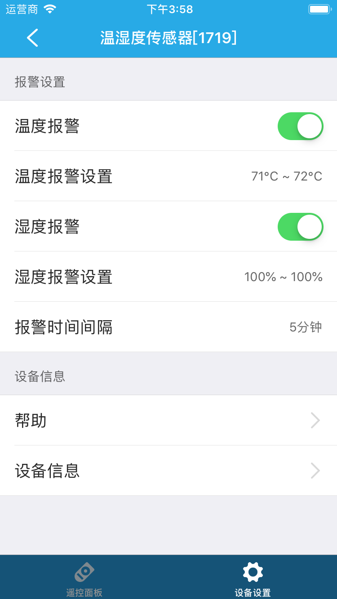

# 温湿度感应器

&emsp;&emsp;您可以点击设备列表或标签页面的温湿度感应器进入控制界面。您可以看到控制面板、设备设置。

1. 控制面板：您可以查看近10小时的温湿度曲线。您可以点击右上角的 ⋮ 按钮(部分设备支持)，查看帮助和设备信息。

	
	
	
	
2. 设备设置(部分设备支持)：

	
	
	1. 温度报警：启用该功能后，如果温度值不在您设置的范围内将会收到推送信息。
	2. 温度报警设置：设置温度报警范围。
	3. 湿度报警：启用该功能后，如果湿度值不在您设置的范围内将会收到推送信息。
	4. 湿度报警设置：设置湿度报警范围。
	5. 报警时间间隔：设置报警时间间隔。
	6. 帮助：查看该设备相关的常见问题及解决办法。
	7. 设备信息：查看该设备的详细信息。
