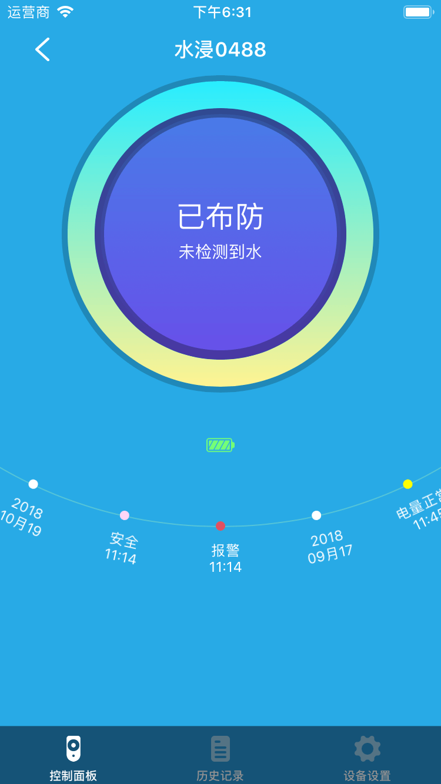
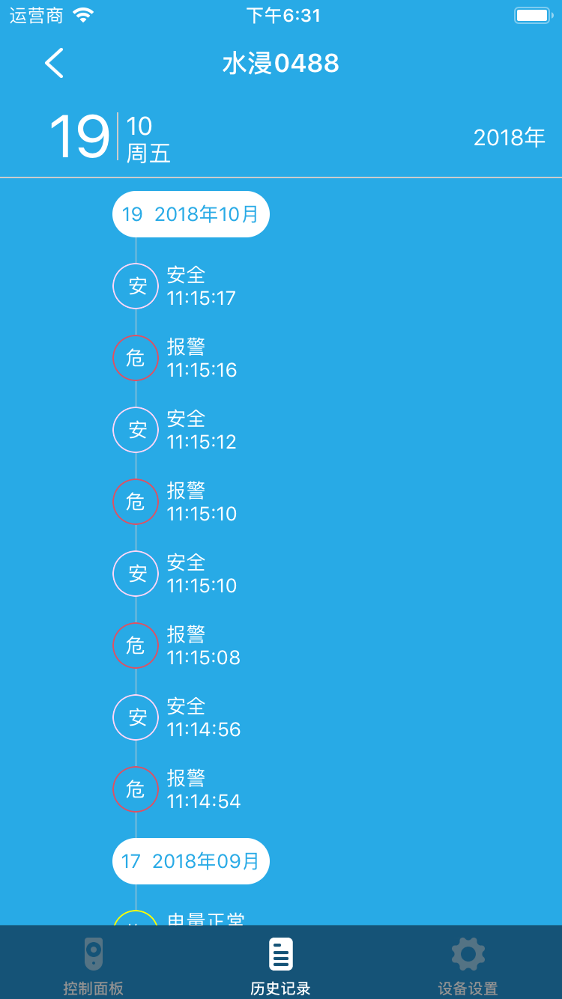

# 智能水感

&emsp;&emsp;在设备列表或标签页面点击智能水感设备进入控制页面。您将看到控制面板、历史记录、设备设置界面。

1. 控制面板：可以看到当前设备的布防状态。只有在布防状态才能检测到水。同时可以查看设备的电量状态，历史记录。

	
	
2. 历史记录：查看到设备的历史记录。

	
	
3. 设备设置：

	1. 帮助：查看到该设备的常见问题及解决办法。
	2. 设备信息：查看到设备的详细信息。