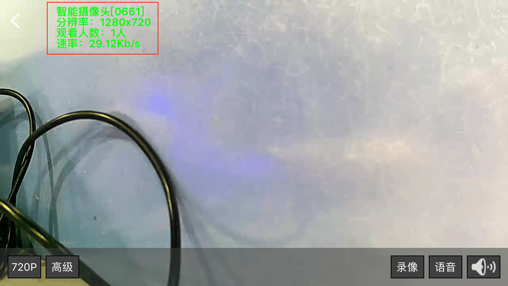
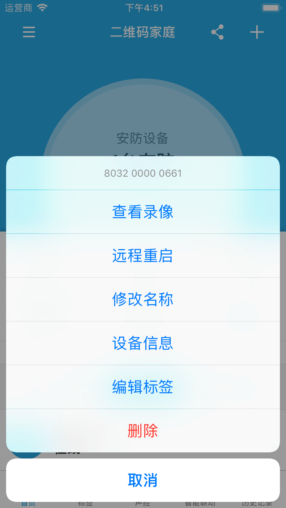

# 智能摄像头

&emsp;&emsp;在设备列表或标签页面点击摄像头进入控制界面。轻点屏幕您可以看到当前的状态信息。

1. 720P: 点击720P，您可以设置视频的分辨率，720P、高清、普清。

	
	
2. 高级：点击高级，您可以截图或者翻转视频。

	
	
3. 录像：点击录像开启录像功能。开启后背景色变成红色，再次点击后，取消录像。

	
	
4. 语音：点击语音，然后按住按住说话提示框开始说话，再次点击“语音”，隐藏“按住说话”提示框。

	
	
5. 静音：点击静音开启静音功能，再次点击，取消静音

	
	
	
&emsp;&emsp;您可以在设备列表左滑摄像头，点击编辑按钮，可查看设备信息。

1. 查看录像：查看视频录像，效果和在设备列表点击摄像头一样。
2. 远程重启：远程重启设备。
3. 修改名称：修改设备名称。
4. 设备信息：查看设备的详细信息。
5. 编辑标签：在某一个标签中添加或删除该设备。
6. 删除：删除设备。