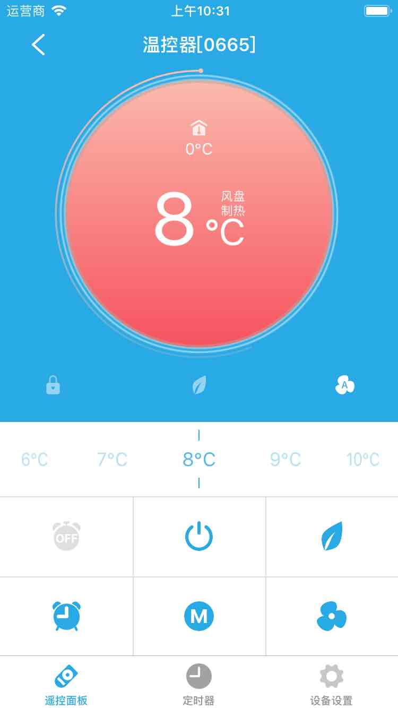
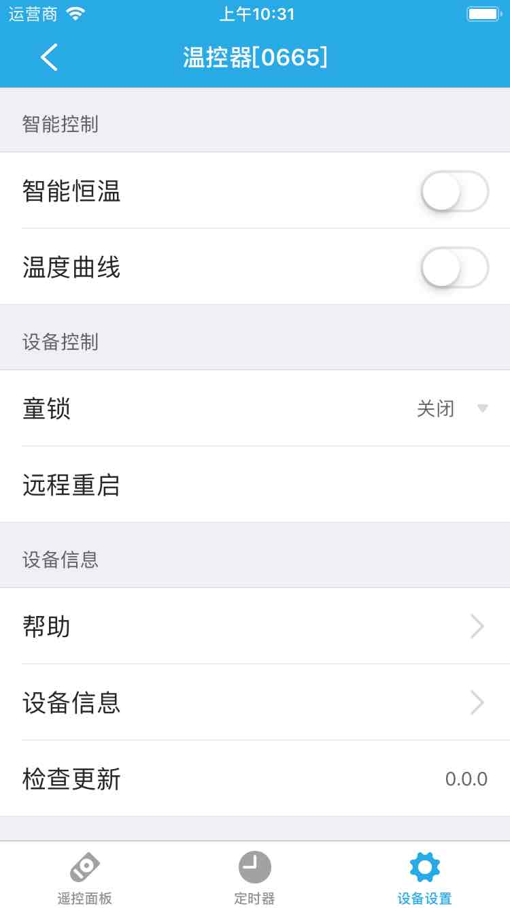

# 温控器

&emsp;&emsp;在设备列表或标签界面点击温控器进入设备控制界面。
您将看到遥控面板、定时器、设备设置界面。

1. 控制面板：您可以设置温控器的的温度、模式等。

	
	
2. 定时器：可以添加定时器来控制温控器。
3. 设备设置：

	
	
	1. 智能恒温：可以设置温控器在某一时间段保持在某一个温度范围、模式。
	2. 温度曲线：可以设置某一时间段不同时间点的温度、模式。
	3. 童锁(部分设备支持)：该功能启用时，部分按钮会暂时失去控制功能，避免了儿童因好奇误操作而导致的危险。
	4. 远程重启：可以远程重启该设备。
	5. 帮助：查看该设备相关的常见问题以及解决办法。
	6. 设备信息：查看该设备的序详细信息。
	7. 检测更新：检测是否需要升级。
