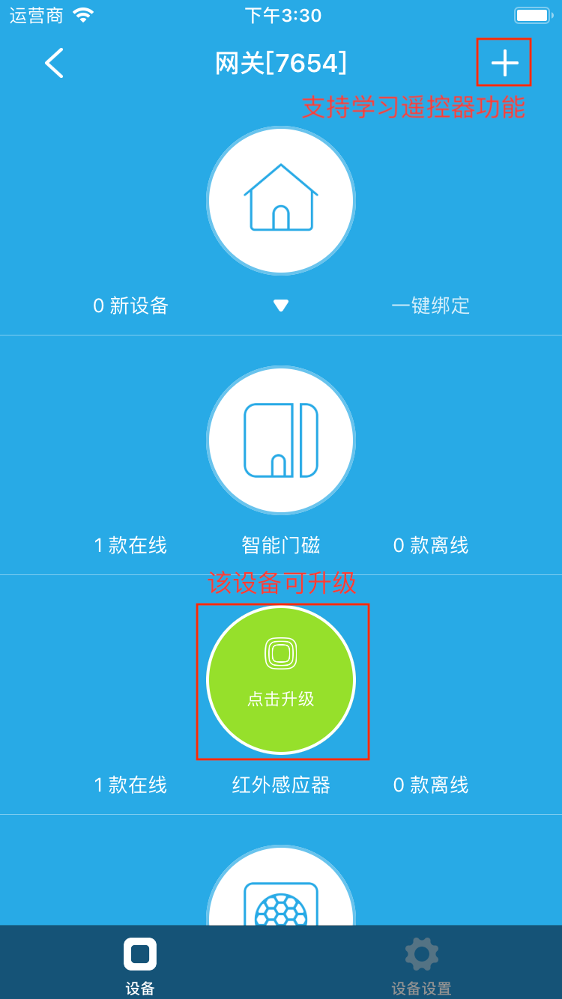
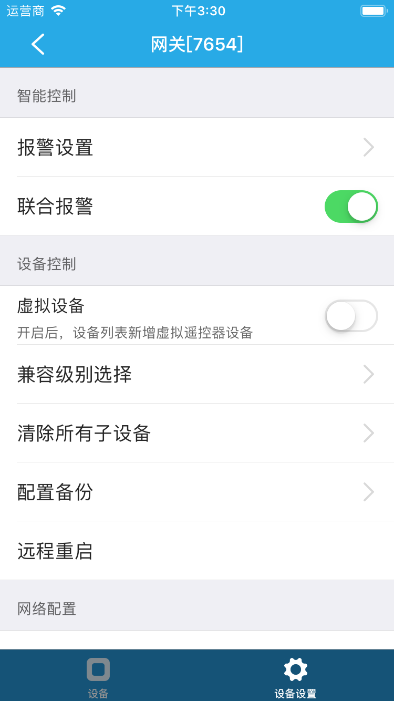
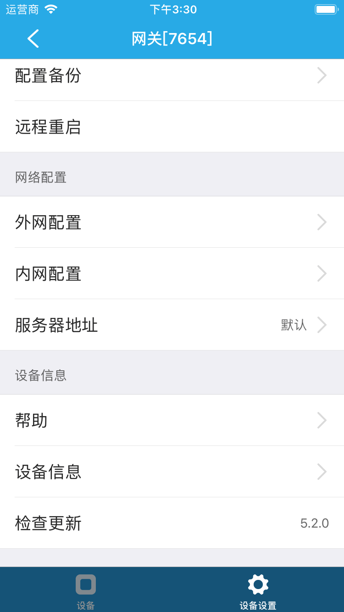

# 网关

&emsp;&emsp;网关主要用来绑定安防类设备、MacBee设备使用。在设备列表或标签页面点击进入网关控制界面，您将看到设备和设备设置两个界面。

1. 设备：可以看到绑定到该网关下的所有子设备以及在线状态，也可以点击子设备图标升级设备（如果检测到可升级）。如果支持学习遥控器功能，在右上角会显示+，您可以点击+进入搜索遥控器界面开始搜索遥控器。
	
	
	
2. 设备设置：

	
	
	
	
	1. 报警设置：可以设置是否允许推送以及报警声音，当子设备报警才有效。
	2. 联合报警(部分设备支持):设置后所有设备都会报警。
	3. 虚拟设备：开启后，设备列表新增虚拟遥控器设备。
	4. 兼容级别选择：可以设置兼容级别。
	5. 清除所有子设备：您可以清除该主机下的所有子设备。
	6. 配置备份：可以导出、导入网关的配置。
	7. 远程重启：可以远程重启网关。
	8. 外网配置：可以自定义配置外网。
	9. 内网配置：可以自定义配置内网。
	10. 服务器地址：可以自定义服务器地址。
	11. 帮助：查看该设备的常见问题以及解决方法。
	12. 设备信息：查看设备的详细信息。
	13. 检查更新：检测该设备是否需要更新。

