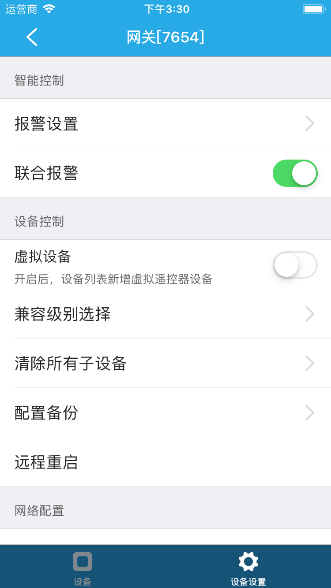

# 主机

&emsp;&emsp;主机需要配合安防类设备、macbee设备使用。用于绑定子设备。
&emsp;&emsp;在设备列表或标签页面点击进入主机控制界面，您将看到设备和设备设置两个界面。

1. 设备：在这里您可以看到绑定到该主机下的所有子设备，您可以看到每个子设备的在线状态，您也可以升级子设备（如果检测到可升级）。如果主机支持学习遥控器的功能，在右上角会显示一个**+**，您可以点击**+**进入搜索遥控器界面开始搜索遥控器。
	
	
	
2. 设备设置

	
	
	
	1. 报警设置：您可以设备是否允许推送以及报警声音，当子设备报警才有效。
	2. 联合报警:
	3. 虚拟设备：开启后，设备列表新增虚拟遥控器设备。
	4. 兼容级别选择：提供了默认、级别1、级别2三个选项。
	5. 清除所有子设备：您可以清除该主机下的所有子设备。
	6. 配置备份：您可以备份主机的配置，方便以后导入。
	7. 远程重启：您可以远程重启主机。
	8. 外网配置：
	9. 内网配置：
	10. 服务器地址：
	11. 帮助：您可以查看该设备常见问题以及解决方法。
	12. 设备信息：您可以查看设备的详细信息。
	13. 检查更新：您可以检测该设备是否需要更新。

