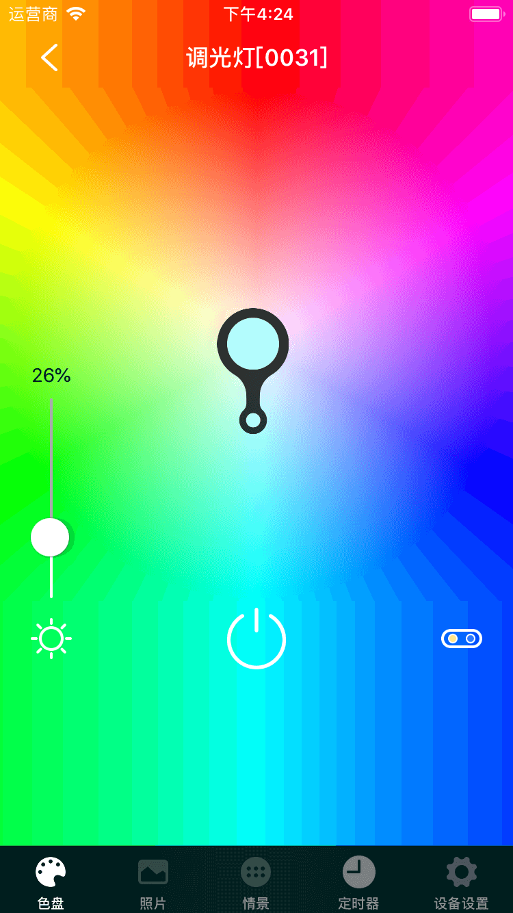
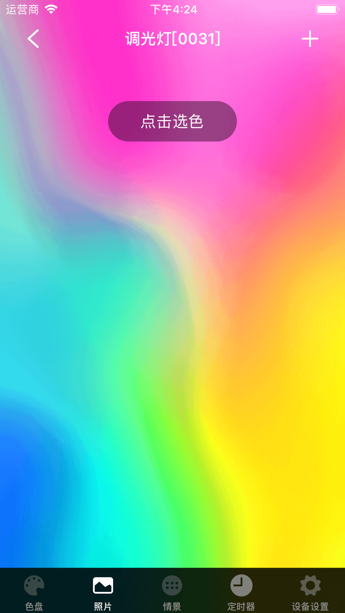

# 灯

&emsp;&emsp;在设备列表或标签页面点击进入灯的控制界面。您将看到色盘、照片、情景、定时器、设备设置5个界面。

1. 色盘：在这里您可以通过RGB或WC来控制灯的颜色。选择一种方式后点击色盘任意位置即可灯的颜色。同时还可以控制灯的亮度。

	
	
	
2. 照片：在这里默认提供了一张照片，您可以点击照片不同位子控制灯的颜色。您也可以点击右上角的+从相册或拍照功能选择一张照片，然后从照片上选择颜色来控制灯。

	
	
3. 情景：在您可以设置任意一种情景来控制灯。

	
	
4. 定时器：您可以点击右上角的+添加定时器。

	
	
5. 设备设置：

	
	
	1. 渐亮渐灭：开启后可实现灯的渐亮渐灭效果。
	2. 远程恢复出厂：您可以远程恢复出厂该设备。
	3. 远程重启：您可以远程重启该设备。
	4. 重置设备无线连接：
	5. 断电恢复：开启该功能后，当设备断电后重新上电，恢复到断电前的状态。
	6. 帮助：您可以在这里查看该设备相关的常见问题以及解决办法。
	7. 设备信息：您可以查看该设备的详细信息。
	8. 检查更新：检测该设备是否需要升级。
