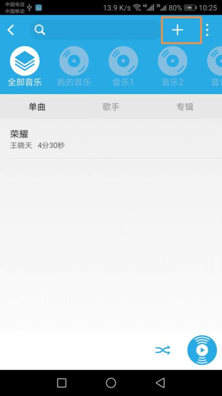
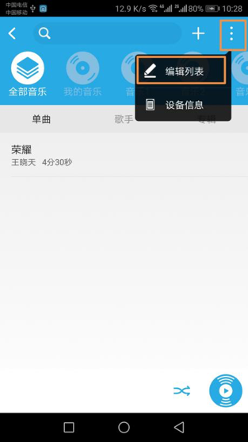
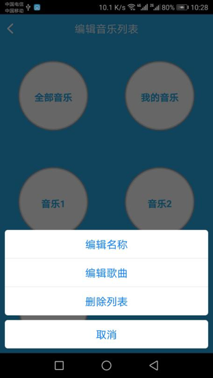

# 音乐播放器

&emsp;&emsp;在设备列表或标签界面点击音乐播放器进入控制界面，将看到所有列表和歌单。

1. 新建音乐列表：在控制界面点击“+”按钮，按照步骤即可添加音乐列表。

	
	
2. 编辑音乐列表：在控制界面点击更多按钮，即可看到编辑列表选项，选择“编辑列表”进入编辑音乐列表界面，点击音乐列表，即可看到“编辑名称”、“编辑歌曲”、“删除列表”选项。

<figure class="half">

</figure>

