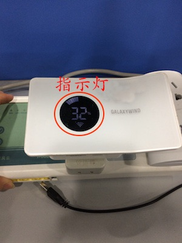

# 空调插座

&emsp;&emsp;在设备列表或标签界面点击空调插座进入设备控制界面。
您将看到遥控面板、电量管家、设备设置、历史记录、荣誉排行界面。

1. 控制面板：您可以设置空调的温度、模式、定时等等。点击右上角的 ⋮ 按钮，您可以查看近24小时的温湿度曲线图。

	
	
	部分设备支持学习功能，会显示一个+按钮，您可以点击+，根据提示添加学习功能。
2. 电量管家：您可以查看近一年的电量以及详细信息。您还可以查看阶段电量并且可以清零。

	
	
	
	
3. 设备设置：

	
	
	
	
	1. 智能恒温：可以设置在某一时间段让空调保持在某一温度范围、模式。
	2. 温度曲线(部分设置支持)：可以设置在某一个时间段不同时间点的温度、模式。
	3. 智能睡眠：可以让空调进入睡眠状态，可以省电。
	4. 定时器：可以添加定时器来控制空调。
	5. 推送通知(部分设置支持)：开启该功能后，设备的状态发生变化时您将收到推送信息。
	6. 童锁：该功能启用时，部分按钮会暂时失去控制功能，避免了儿童因好奇误操作而导致的危险。
	7. 指示灯控制：可以设置指示灯的显示。

		
		
	8. 指示灯颜色(部分设置支持)：可以设置指示灯的颜色。
	9. 远程重启：可以远程重启设备。
	10. 电量管理(部分设置支持)：可以设置峰谷电时间段以及清零所有电量。
	11. 参数校正(部分设置支持)：可以校正温度。
	12. 匹配空调类型：学习空调遥控器的红外编码。
	13. 帮助：查看该设备相关的常见问题以及解决办法。
	14. 设备信息：查看该设备的详细信息。
	15. 检测更新：检测是否需要升级。

4. 历史记录：可以查看该设备的状态变化记录。

	
	
5. 荣誉排行：您可以查看本周用电、空调温度、开机时长等排行榜，并且可以分享给您的朋友。

	
	
	
# 机顶盒 #

&emsp;&emsp;如果您用的是空调插座增强版，在设备列表会同时显示一个机顶盒。

&emsp;&emsp;点击机顶盒进入控制界面。

&emsp;&emsp;初次使用时点击任意按钮都需要进行匹配编码，根据提示，匹配完成后才能使用。

&emsp;&emsp;匹配完成后，在控制界面长按按钮进行学习编码，只有学习了编码的按钮才能正确控制。也可以点击右上角的+添加按键。

