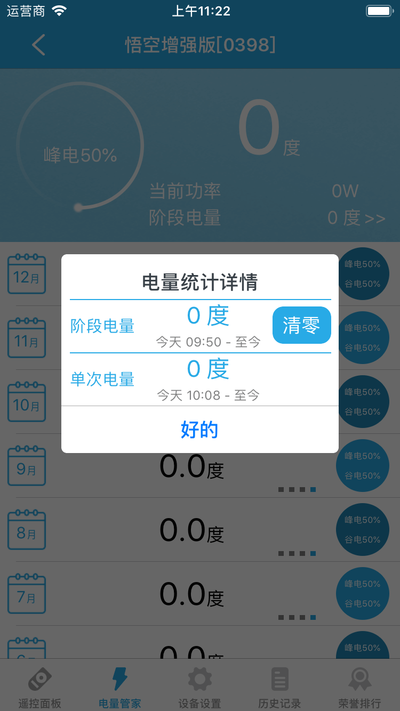

# 空调插座

&emsp;&emsp;在设备列表或标签界面点击空调插座进入设备控制界面。
您将看到遥控面板、电量管家、设备设置、历史记录、荣誉排行。

1. 遥控面板：您可以设置空调的温度、模式、定时等等。点击右上角的更多按钮，您可以查看近24小时的温湿度曲线图。

	
	
2. 电量管家：您可以查看近一年的电量以及详细信息。您还可以查看阶段电量并且可以清零。

	
	
	
3. 设备设置：您可以设置智能恒温、温度曲线、智能睡眠、定时器、推送通知、童锁、指示灯控制、远程重启、电量管理、参数校正、匹配空调类型，查看帮助、设备信息、检测更新。

	
	
	
	1. 智能恒温：开启该功能后，您可以设置在某一个时间段让空调保持在缪一个温度范围、模式。
	2. 温度曲线：开启该功能后，您可以设置在某一个时间段每个时间点的温度、模式。
	3. 智能睡眠：开启该功能后，可以让空调进入睡眠状态，可以省电。
	4. 定时器：您可以最多添加20个定时器。
	5. 推送通知：开启该功能后，设备的状态发生变化时您将收到一条推送信息。
	6. 童锁：您可以设置童锁功能，禁止小孩使用遥控器控制空调。
	7. 指示灯控制：您可以设置指示灯的显示。
	8. 远程重启：您可以远程重启设备。
	9. 电量管理：您可以设置峰谷电时间段，电量清空。
	10. 匹配空调类型：开启云智能分析你的空调。
	11. 帮助：您可以在这里查看该设备相关的常见问题以及解决办法。
	12. 设备信息：您可以查看该设备的序列号、版本号、连接服务器状态等信息。
	13. 检测更新：检测是否需要升级。
4. 历史记录：您可以查看该设备的状态变化记录。

	
	
5. 荣誉排行：您可以查看本周用电、空调温度、开机时长等排行榜，并且可以分享给您的朋友。

	
	
