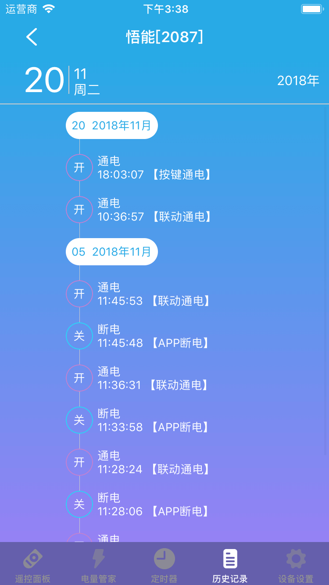

# 智能插座

&emsp;&emsp;在设备列表或标签页面点击智能插座进入控制界面。您将看到控制面板、电量管家、定时器、历史记录(支持)、设备设置界面。

1. 控制面板:您可以对插座进行通电断电操作。

	
	
2. 电量管家:您可以查看近一年的电量以及电量详细信息。您还可以查看阶段电量并且可以对阶段电量清零。

	
	
3. 定时器:您可以最多添加20个定时器来实现通电断电。
4. 历史记录：您可以查看智能插座的状态变化。

	
	
5. 设备设置：

	

	1. 电器选择：我们提供了8种类型供您选择，分别是：饮水机、台灯、风扇、热水器、路由器、冰箱、音响、其它。设置后将显示对应的图标和名称(如果您没有修改名称)，方便查看。
	2. 推送通知：该功能开启后，当插座的状态发生变化您将收到推送通知，能及时知道设备状态变化。
	3. 指示灯控制：默认情况下插座通电状态下指示灯会常亮，您可以在这里进行设置。
	4. 远程重启：可以远程重启插座智能设备。
	5. 电量管理：您可以设置峰电、谷电时间段。
	6. 断电恢复：这里提供了两个选项：保持断电和恢复到断电前的状态。如果您设置了保持断电，当设备断电后重新上电，插座将是断电状态；如果您设置了恢复到断电前的状态，当设备断电后重新上电，插座的通断电状态恢复到之前的状态。
	7. 帮助：您可以在这里查看该设备相关的常见问题以及解决办法。
	8. 设备信息：您可以查看该设备的序列号、版本号、连接的wifi等信息。
	9. 检查更新：检查该设备是否需要更新。

