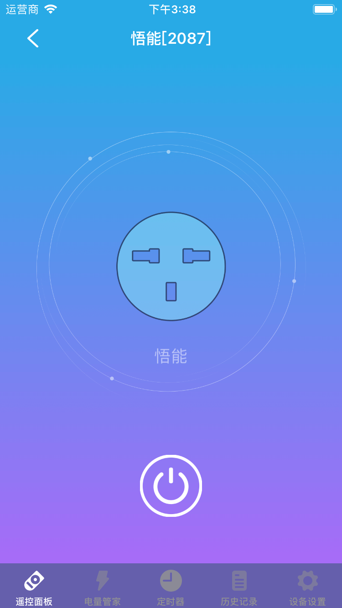
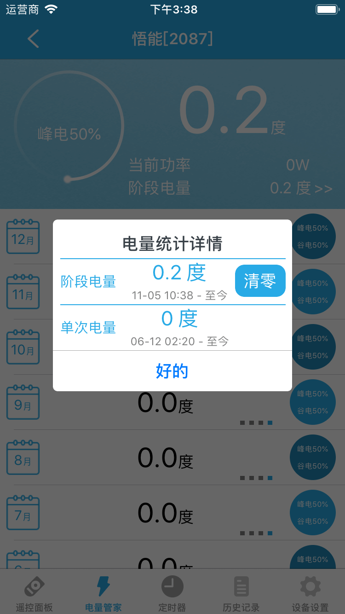
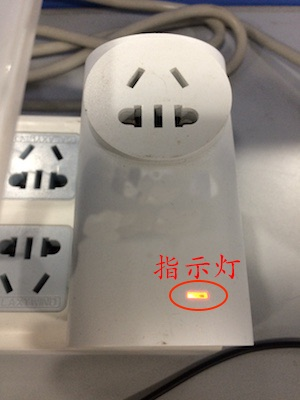

# 智能插座

&emsp;&emsp;在设备列表或标签页面点击智能插座进入控制界面。您将看到控制面板、电量管家、定时器、历史记录(部分设备支持)、设备设置界面。

1. 控制面板:您可以对插座进行通电断电操作。

	
	
2. 电量管家:您可以查看近一年的电量以及电量详细信息。查看阶段电量并且可以清零。

	
	
	
3. 定时器:您可以最多添加20个定时器来实现通电断电。
4. 历史记录：您可以查看智能插座的状态变化。

	
	
5. 设备设置：

	

	1. 电器选择：我们提供了8种类型供您选择，分别是：饮水机、台灯、风扇、热水器、路由器、冰箱、音响、其它。设置后将显示对应的图标和名称(如果您没有修改名称)，方便查看。
	2. 推送通知：该功能开启后，当插座的状态发生变化您将收到推送通知，能及时知道设备状态变化。
	3. 指示灯控制：设置指示灯显示。默认情况下通电状态下指示灯会常亮，断电状态下熄灭。

		
		
	4. 远程重启：可以远程重启插座智能设备。
	5. 电量管理：您可以设置峰电、谷电时间段。
	6. 断电恢复：这里提供了两个选项：“保持断电”和“恢复到断电前的状态”。如果您设置了“保持断电”，当设备断电后重新上电，插座是断电状态；如果设置了“恢复到断电前的状态”，当设备断电后重新上电，插座的通断电状态恢复到之前的状态。
	7. 帮助：查看该设备的常见问题以及解决办法。
	8. 设备信息：查看该设备的的详细信息。
	9. 检查更新：检查该设备是否需要更新。

