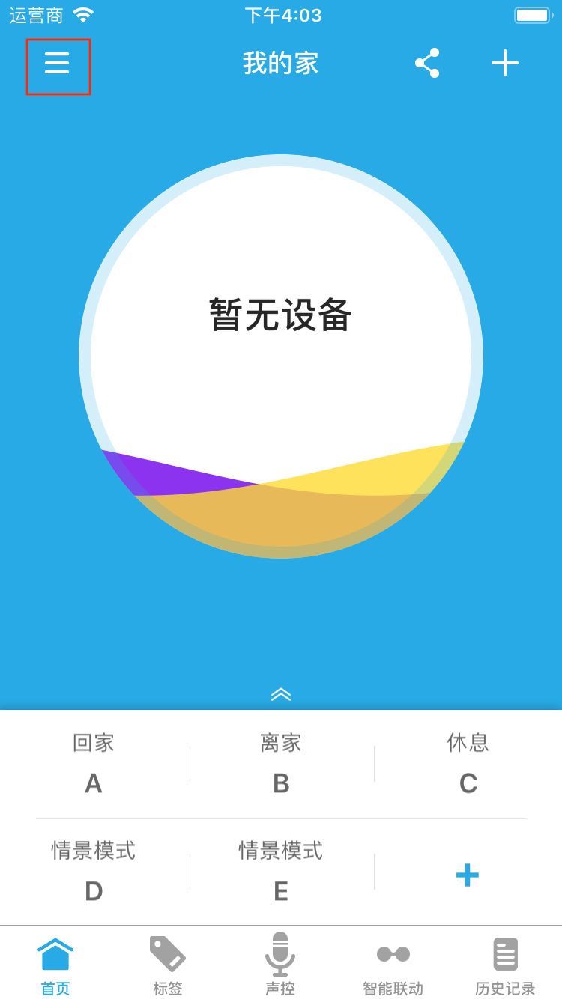
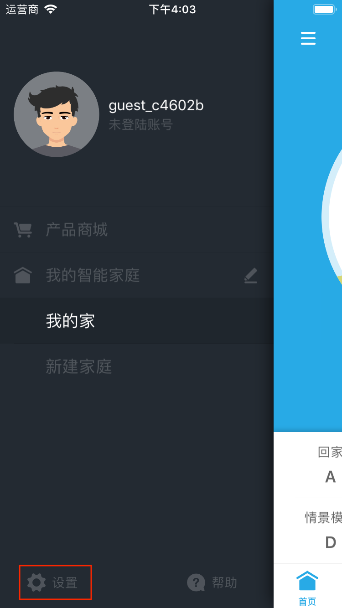
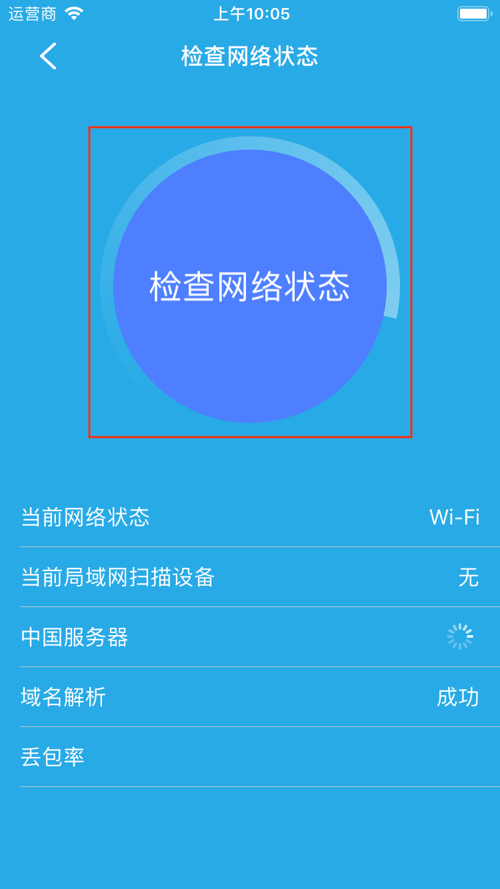
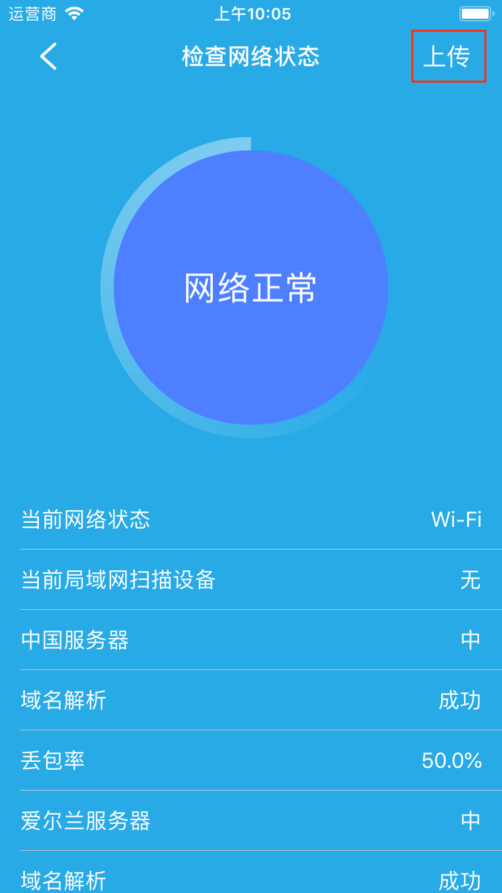

# 系统设置

&emsp;&emsp;您可以根据您的使用习惯对个性化设置App，在设备列表页点击左上角的☰按钮进入侧边菜单栏，您将看到设置选项，点击进入。

## 声音

&emsp;&emsp;打开声音开关后，在控制部分设备时会有相应的声音提示。

#震动

&emsp;&emsp;打开震动开关，控制部分设备时会有震动提示(手机的震动开关关闭的情况下设置无效)。

## 沿用原名

&emsp;&emsp;开启该功能后，自动将未改名设备的名称修改成上一次使用过的名称。

## 摄氏度

&emsp;&emsp;选中该选项后，所有的温控设备的单位都将以摄氏温度显示。

## 华氏度

&emsp;&emsp;选中该选项后，所有的温控设备的单位都将以华氏温度显示。

## 语言设置

&emsp;&emsp;设置APP的显示语言，目前支持中文和英文。

## 手势密码

&emsp;&emsp;设置手势密码可以防止他人借用您的手机使用该App。

## 诊断功能

&emsp;&emsp;该功能用于帮助分析问题。如果您在使用过程中遇到一些问题，您可以先启动该功能，然后再去重复之前的操作，再回到这个界面，点击网络诊断，等动画停止以后点击右上角的上传，以便我们帮您分析问题。

    

## 意见反馈

&emsp;&emsp;可以反馈您在使用该Ap的过程中遇到的问题。根据提示进行操作，最后点击提交即可。

## 给个好评

&emsp;&emsp;将跳转到App应用市场，可以写出您对该App的评价。

## 关于我们

&emsp;&emsp;查看APP简介、当前版本号以及联系方式。
