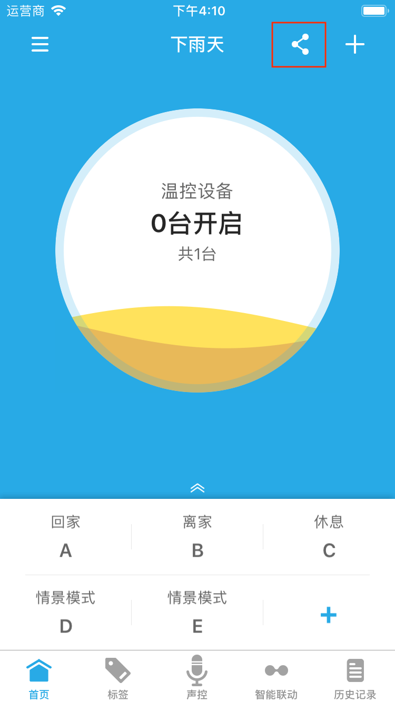
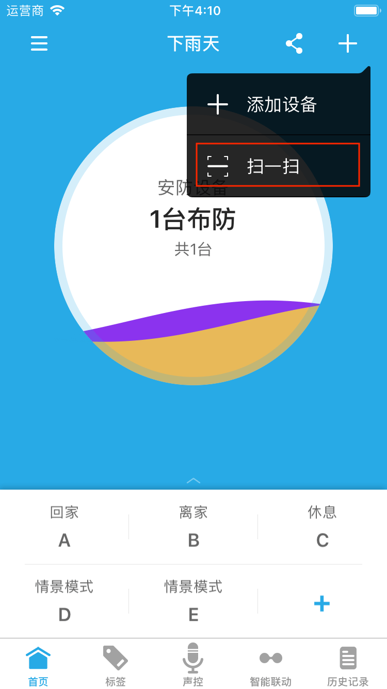

# 管理家庭

## 新建家庭 ##

&emsp;&emsp;点击首页左上方更多按钮打开侧边菜单栏，即可看到新建家庭入口。

<figure class="half">
    
    
</figure>

## 分享家庭与加入家庭 ##

&emsp;&emsp;第一步：点击首页或智能联动界面右上方的分享按钮，打开分享界面，通过显示的二维码即可将家庭分享给其他用户使用。

<figure class="half">
    
    
</figure>

&emsp;&emsp;第二步：在另外一个App上，点击App首页右上方+按钮，选择扫一扫选项，扫描上一步分享界面中的二维码，即可加入家庭，对该家庭内的设备远程控制。

## 退出/删除家庭 ##

&emsp;&emsp;点击首页左上方更多按钮打开侧边菜单栏，然后点击编辑按钮，打开编辑家庭界面，您可以看到删除该家庭（您创建的家庭）或退出该家庭（他人创建的家庭）按钮。

<figure class="third">
    
    
    
</figure>

## 修改家庭名称 ##

&emsp;&emsp;在编辑家庭页面，您可以点击家庭名称，进入编辑页面，输入新的名称后点击保存即可。

## 成员验证 ##

&emsp;&emsp;开启该功能后，他人扫描您的家庭二维码加入您的家庭时需要你同意后才能加入。同时“验证日志”里会有相关记录。

## 家庭成员 ##

&emsp;&emsp;家庭成员列表会显示所有加入到该家庭的成员，您可以左滑删除成员。
