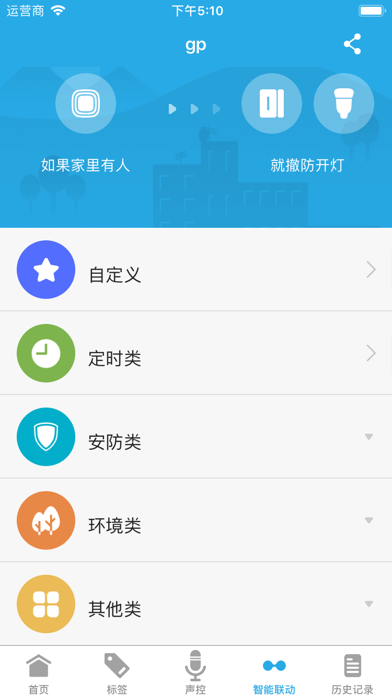
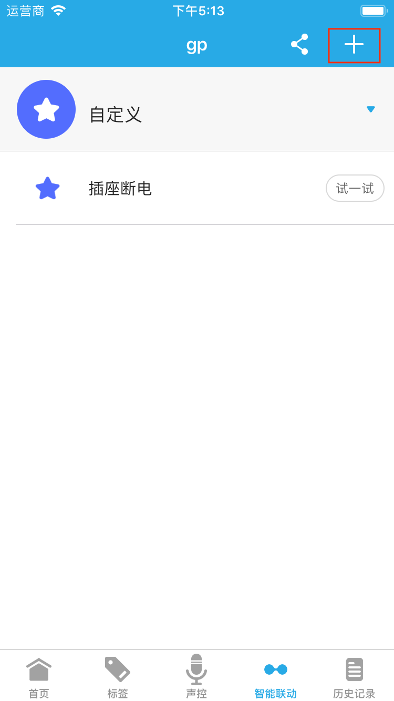

# 智能联动

&emsp;&emsp;如果您的家庭中有银河风云的多种产品，即可选择相应的联动模板进行联动。比如您可设置“如果有人来了，就控制家电”，联动智能红外感应器和悟空i8。当智能红外检测到人，即开启空调。

## 新建

&emsp;&emsp;未添加联动时，进入智能联动界面看到一系列的模板，您可以选择不同的模板进行创建。

&emsp;&emsp;已添加过联动时，在联动界面会显示已添加的联动，您可以点击右上角**+**按钮创建新的联动。

&emsp;&emsp;创建完成以后您可以点击**试一试**查看联动效果。

## 禁用、编辑、删除

&emsp;&emsp;在智能联动界面左滑已经创建好的联动，即可看到禁用、编辑、删除选项。可以进行禁用、编辑、删除操作。

