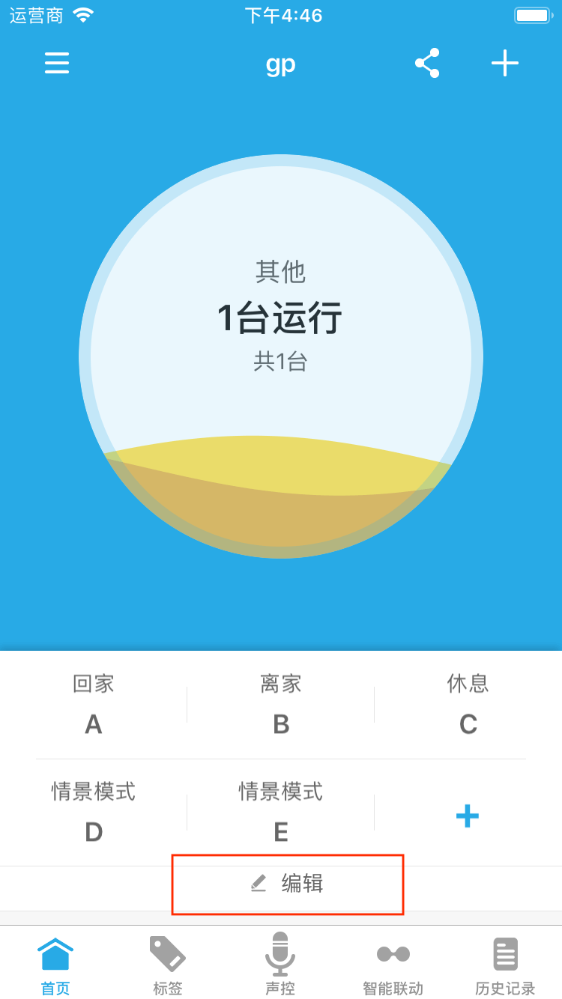
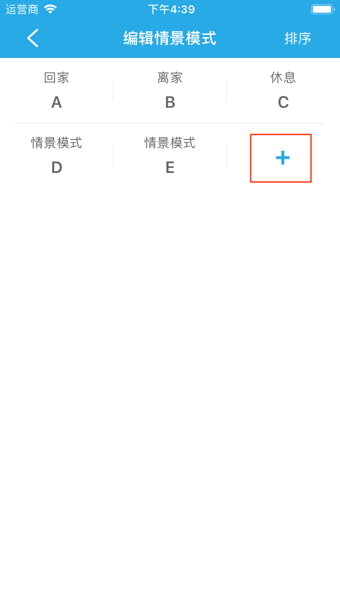
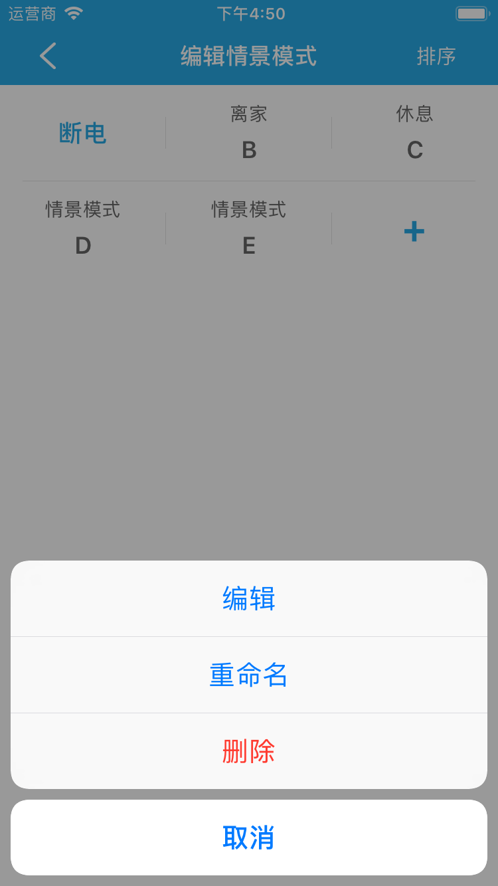

# 情景模式

&emsp;&emsp;情景模式用来记录所选设备的当前状态，当前设备的状态发生改变后方便一键恢复到记录状态。

## 新建
1. 在首页，点击“编辑”按钮进入情景模式管理界面。

2. 在情景管理界面点击**+**按钮，可以新建情景模式。

## 执行

&emsp;&emsp;在设备列表点击创建的情景模式，比如**断电**。

如果您创建了多个情景模式，您可以左右滑动情景列表，再点击执行。

## 编辑、删除、重命名

&emsp;&emsp;情景模式支持编辑、重命名和删除操作，在情景管理界面点击情景模式可对情景模式进行相应的操作。

