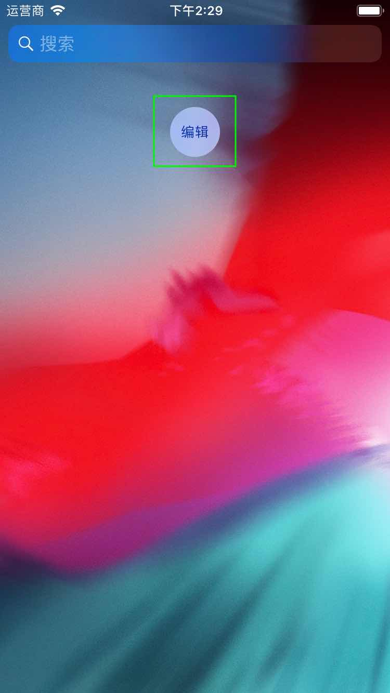
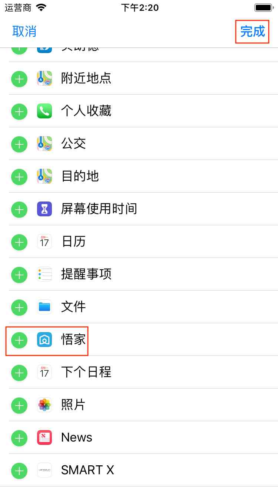
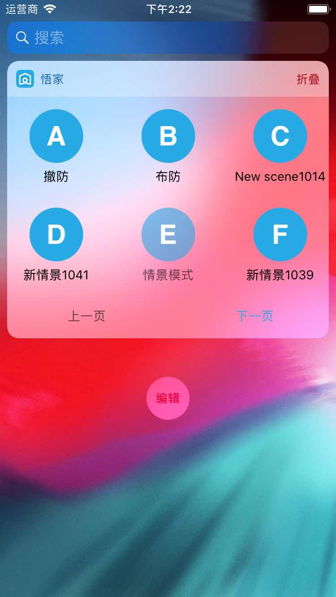

# 情景模式

&emsp;&emsp;情景模式用来记录所选设备的当前状态，选择设备的状态发生改变后方便一键恢复到记录状态。您也可以编辑选择的每一个设备的状态，执行时所选设备都会按照编辑的状态执行。情景模式还支持widget操作，您可以在不启动App的情况下快速执行情景模式。

&emsp;&emsp;回到手机主界面，左滑屏幕，滑到最左边，您将看到如下图所示的界面。

&emsp;&emsp;点击编辑按钮添加小组件。在列表中找到悟家，点击悟家左侧的+，然后点击右上角的完成按钮即可。

添加之后列表中将显示所有的情景模式。您可以快速执行情景模式。

