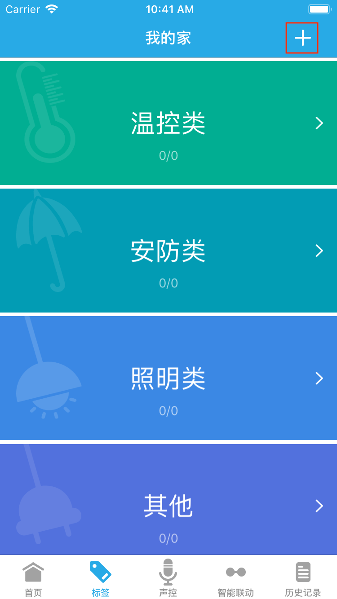
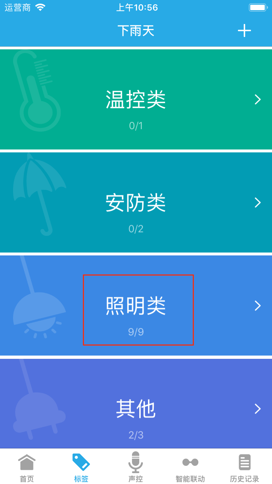
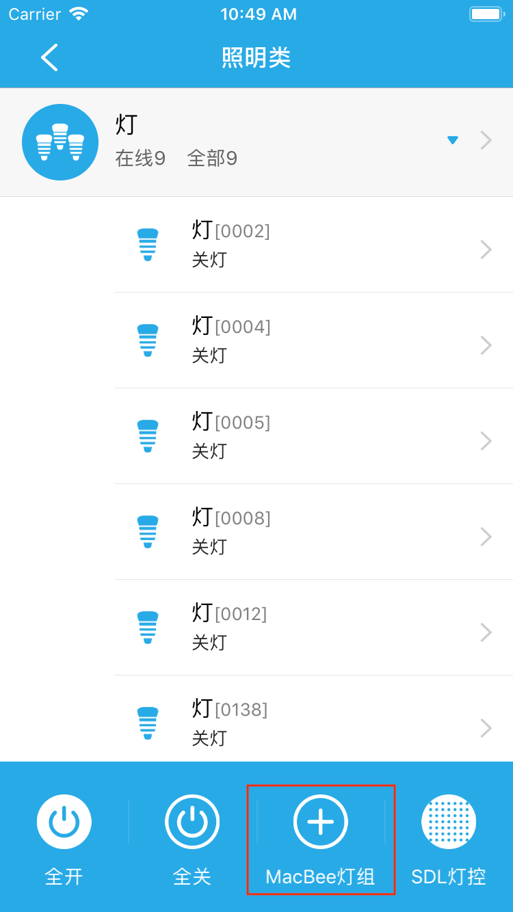

# 4. 标签

&emsp;&emsp;标签默认分类为温控类、安防类、照明类、其他；默认标签会自动将相应设备进行分组，也可以增加新的标签类。同一标签内的所有设备可以执行一键全开、一键全关或者布防、撤防操作。

## 新建标签 ##

&emsp;&emsp;点击标签界面右上角+按钮，即可进入新建标签界面。

&emsp;&emsp;输入标签名称点击下一步，进入编辑标签界面，选择设备后(也可以不选设备，后面可以编辑)点击完成，即可完成新建标签，在标签界面可看到该新建标签

## 编辑标签

&emsp;&emsp;在标签界面左滑标签，即可看到编辑、删除按钮（默认标签无法编辑）

## 新建灯组

&emsp;&emsp;灯组是照明类设备的集合，可以统一控制多个照明类设备的开关、亮度、颜色等状态。

&emsp;&emsp;在标签界面点击照明类，进入照明类标签控制界面。

&emsp;&emsp;点击MacBee灯组按钮，即可进入新建灯组界面，灯组新建完成后，在照明类标签界面和标签界面即可查看。

<figure class="half">
    
    
</figure>

## 删除标签/灯组

&emsp;&emsp;在标签界面左滑标签/灯组，即可看到删除选项，点击删除按钮即可完成删除操作。
