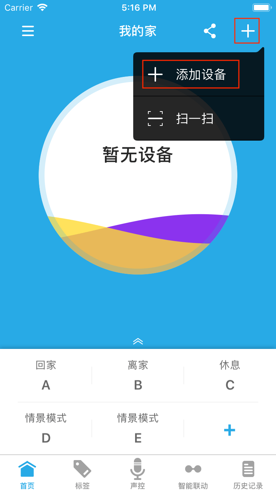
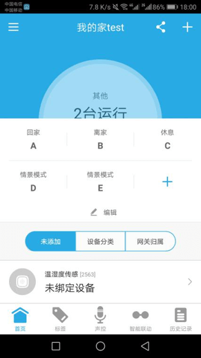
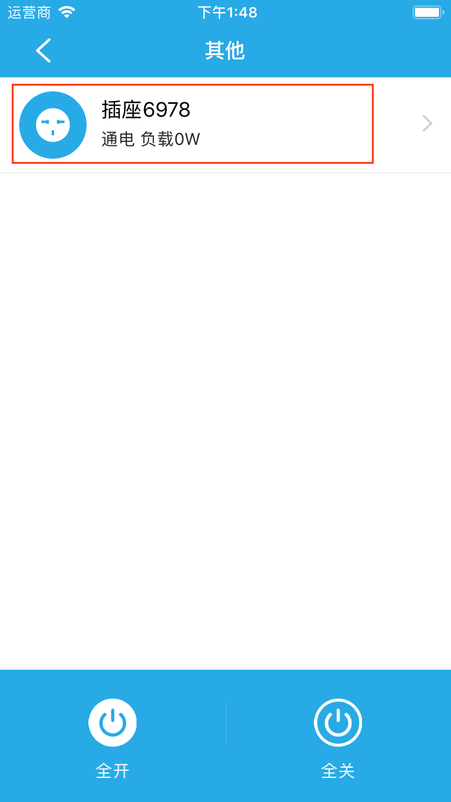
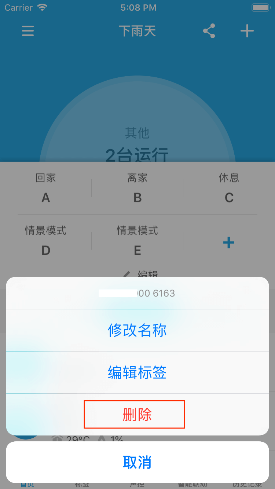
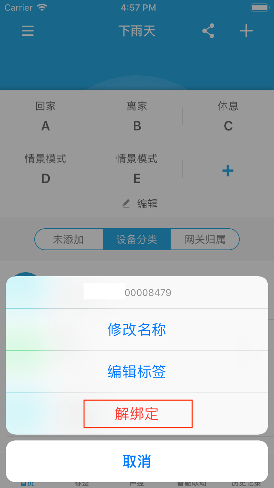

# 设备管理

## 添加设备

### 添加WiFi设备 ##

1. WiFi设备通电状态下，长按Reset按钮，直到红灯闪烁，设备恢复出厂。
2. 手机先连接WiFi网络，然后点击悟家app首页右上角的+按钮，选择添加设备。
	
    
    
3. 输入WiFi密码，点击开始搜索按钮，等待设备连接，设备添加成功会加入家庭。
	
    

### 添加MacBee设备 ##

&emsp;&emsp;MacBee设备需要配合网关使用，如果您的家庭中有网关，请按照下面的步骤添加，如果没有请先添加网关。

1. MacBee设备通电状态下，用牙签或顶针顶住设备的复位孔，直到红灯闪烁，设备恢复出厂。
2. 打开app，即可看到MacBee设备显示在首页的未添加设备列表。

	
	
3. 点击设备即可看到绑定选项，点击绑定按钮，选择网关，即可绑定MacBee设备到该网关；也可在所选网关控制界面绑定MacBee设备。
<figure class="half">
    
    
</figure>

### 设备控制

&emsp;&emsp;您可以从设备列表或者标签页面(后面会详细介绍)点击进入设备进入控制界面。
<figure class="half">
    
    
</figure>

### 删除设备

1. 在设备列表界面左滑设备您以可看到编辑按钮。

	
	
2. 点击编辑按钮即可看到WiFi设备的删除设备选项，MacBee设备的解绑定选项。您还可以修改密码（部分设备支持）、修改名称、编辑标签。

<figure class="half">
    
    
</figure>