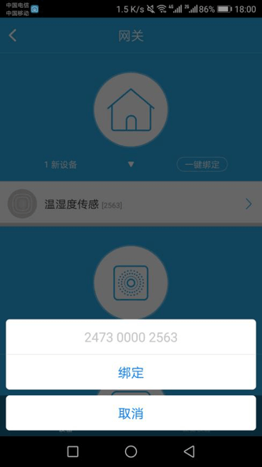

# 添加

## 添加Wi-Fi设备

1. Wi-Fi设备在通电状态下，长按Reset按钮(可以参考设备说明书)，直到红灯闪烁，设备恢复出厂。
2. 手机先连接Wi-Fi网络，然后点击悟家App首页右上角的+按钮，选择添加设备。
	
    
    
3. 输入Wi-Fi密码，点击开始搜索按钮，等待设备连接，设备添加成功后会加入当前家庭(后面会详细介绍什么是家庭)。
	
    

## 添加MacBee设备

&emsp;&emsp;MacBee设备需要配合网关使用，如果您的家庭中有网关，请按照下面的步骤添加，如果没有，请先添加网关。

1. MacBee设备通电状态下，用牙签或顶针顶住设备的复位孔，直到红灯闪烁，设备恢复出厂。
2. 打开App，即可看到MacBee设备显示在首页的未添加设备列表。

	
	
3. 点击设备即可看到绑定选项，点击绑定按钮，选择网关，即可绑定MacBee设备到该网关；也可在所选网关控制界面绑定MacBee设备。

    

