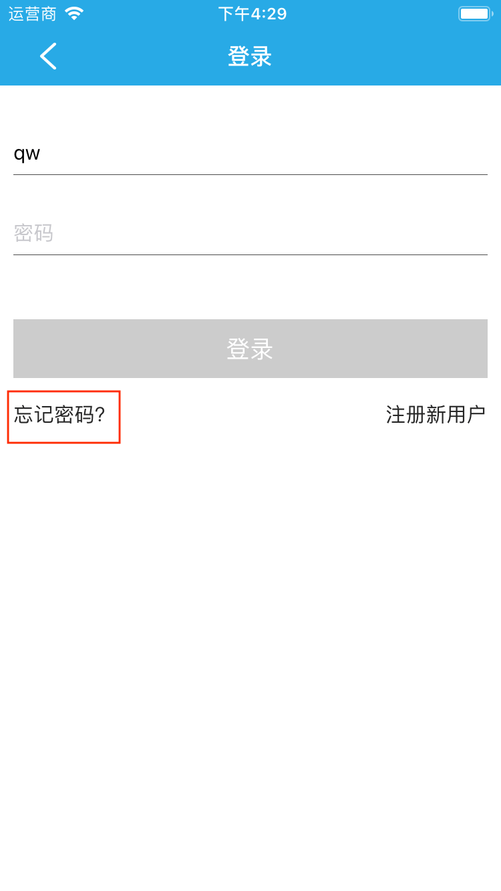
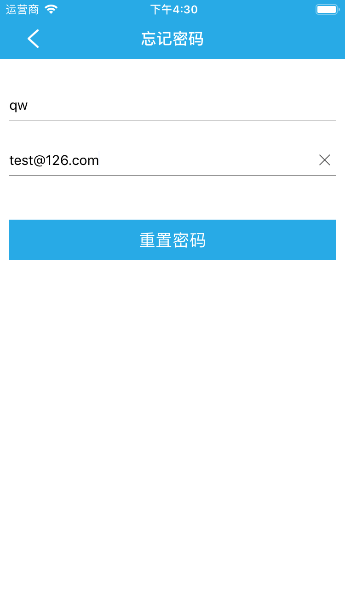

# 登录/注册账号

&emsp;&emsp;打开App，点击首页左上方的☰按钮，打开侧边菜单栏，您可以看到未登录账号。

	
&emsp;&emsp;点击未登录账号，进入账号管理界面。您可以看到登录账号和注册账号。

&emsp;&emsp;点击登录账号或注册账号，根据提示输入账号、密码等信息即可完成登录或注册。

## 绑定邮箱

&emsp;&emsp;绑定邮箱可以用于忘记密码后重置密码，用来接收系统重新设置的新密码，防止忘记密码后账号无法登录。

&emsp;&emsp;点击首页左上角☰按钮打开侧边菜单栏，您可以看到当前账号是否绑定了邮箱。如果未绑定，会显示未绑定邮箱，如果已经绑定了邮箱，会显示您的邮箱账号。

    
&emsp;&emsp;点击未绑定邮箱选项，即可进入绑定邮箱界面，填写邮箱和验证码最后点击绑定按钮，即可完成绑定邮箱。

## 修改密码 ##

&emsp;&emsp;点击首页左上方☰按钮打开侧边菜单栏，点击账号头像您可以看到修改密码选项。

    

    
&emsp;&emsp;点击修改密码按钮即可进入修改密码界面，按照要求输入旧密码和新密码，最后点击确定按钮即可成功修改密码。

## 忘记密码 ##

&emsp;&emsp;在账号登录界面点击忘记密码，即可进入密码重置界面。

    
&emsp;&emsp;按要求输入已有用户名和用户所绑定的邮箱，点击重置密码即可成功重置密码。

